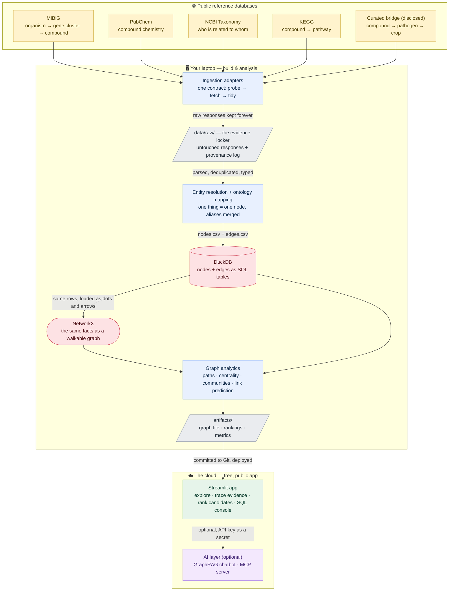

# MicrobeGraph 🕸️🦠🌱

**▶ Live app — coming after the deployment phase** · **v0.1.0 (in development)** ·


-informational)

**Turning scattered public facts about which microbe makes which molecule, and
which molecule acts against which crop disease, into a single graph you can
walk, query, and ask questions of in plain English — built from scratch, in
public, fully explained.**

> Every term used anywhere in this repo — biological or technical — is defined
> in plain language in [`docs/GLOSSARY.md`](docs/GLOSSARY.md). If a word isn't
> there, that's a documentation bug.

---

## Contents

- [What is a knowledge graph? (start here)](#what-is-a-knowledge-graph-start-here)
- [The problem this project tackles](#the-problem-this-project-tackles)
- [How it works](#how-it-works)
- [The data at a glance](#the-data-at-a-glance)
- [Results, phase by phase](#results-phase-by-phase) — fills in as each phase completes
- [Build log](#build-log) — every phase, linked to its guide, with status
- [**The tutorial, in order**](#the-tutorial-in-order) — the documents that teach every step from a blank laptop
- [Roadmap](#roadmap) — three releases, eighteen phases, each tool justified
- [About the data (honesty notes)](#about-the-data-honesty-notes)
- [Repository map](#repository-map) — every file, annotated
- [How to run](#how-to-run)
- [How I work on this repo (branch model)](#how-i-work-on-this-repo-branch-model)
- [Why the documentation is so detailed](#why-the-documentation-is-so-detailed)

---

## What is a knowledge graph? (start here)

Start with something completely non-scientific: a **city transport map**.

A transport map does not tell you facts in sentences. It draws **dots** and
**lines**. Dots are places (stations). Lines are relationships between places
("you can travel directly from here to there"). Once you have that picture, you
can answer questions no single sentence contains — *what is the shortest route
from Baker Street to Waterloo?*, *which station would break the most journeys if
it closed?* — just by **walking the map**.

A **knowledge graph** is exactly that idea applied to facts instead of stations.

- A **node** is a thing: a microbe, a molecule, a plant disease, a crop.
- An **edge** is a relationship between two things, with a direction and a name:
  *produces*, *inhibits*, *infects*.
- A **fact** is therefore a tiny three-part sentence — **subject → relationship
  → object** — and the graph is just thousands of those sentences drawn as dots
  and arrows.

Here is one chain of real-world biology written that way:

```
Bacillus velezensis  --produces-->  surfactin  --inhibits-->  Botrytis cinerea  --infects-->  strawberry
```

Read left to right, that says: *a soil bacterium makes a soapy molecule; that
molecule suppresses grey-mould fungus; grey mould rots strawberries.* Four
facts, four dots, three arrows. And now notice what you can do with it that you
could **not** do with four separate spreadsheets: you can start at *strawberry*
and walk **backwards** to find every microbe that might protect it — even though
no single table anywhere contains a "microbe → crop" column.

That backwards walk is the whole point of this project.

### Why a graph and not a spreadsheet?

A spreadsheet (a **table**) is a grid: fixed columns, one row per thing. Tables
are brilliant at *counting* and *filtering* — "how many compounds are
antifungal?" — and this project keeps a table version for exactly that.

But tables are bad at **chains of unknown length**. To ask "microbe → ? → ? →
crop" in a spreadsheet you must know in advance how many hops the answer needs
and build a column for each. A graph doesn't care: you just keep following
arrows until you arrive.

Everyday version of the same contrast: your phone's contact list is a table
(name, number, email — perfect for looking up one person). A social network is a
graph (who knows whom — perfect for "friends of friends who live in my city").
Different shapes for different questions. **MicrobeGraph builds both, from the
same facts**, and the docs explain when to reach for each.

### Three more words you'll meet immediately

- **Microbe** — a living thing too small to see: a bacterium, a fungus, a yeast.
  Some are harmful, many are harmless, and a few are actively *useful* to plants.
- **Metabolite** (or "compound") — a small chemical a microbe manufactures and
  releases. Think of the microbe as a tiny factory and the metabolite as its
  product. Some of those products happen to be poisonous to plant diseases.
- **Biological (crop protection)** — using a living organism or a natural
  molecule to protect a crop, instead of a synthetic pesticide. The commercial
  and scientific question behind this whole field is: *out of the thousands of
  natural candidates, which ones are actually worth developing?*

---

## The problem this project tackles

**The pain point.** The knowledge needed to answer "*which microbes plausibly
act against this crop disease, and what is the evidence chain?*" already exists
— but it is **shattered across databases that don't talk to each other**, and
each holds only one link of the chain:

- **MIBiG** knows which organism carries which gene cluster, and what compound
  that cluster produces. It does not know what the compound attacks in a field.
- **PubChem** knows the compound's chemistry — formula, weight, structure,
  synonyms. It does not know which microbe made it.
- **NCBI Taxonomy** knows how organisms are related to each other. It knows
  nothing about chemistry.
- **KEGG** knows which biochemical pathway a compound belongs to.
- The final, most valuable link — *this compound suppresses that pathogen on
  that crop* — mostly lives in the prose of scientific papers, in no downloadable
  table at all.

On top of the scatter, three specific frictions make joining them genuinely
hard, and every one of them is a documented, taught phase in this repo:

1. **The same thing has different names in different places.** One molecule may
   be "surfactin" here, `CID 443324` there, and `CHEBI:63863` somewhere else.
   Deciding that all three are one dot on the map is a real skill with a real
   name — **entity resolution** — and it's the step most tutorials quietly skip.
2. **Nothing records how confident it is.** A fact hand-checked by a curator
   from a published experiment and a fact auto-guessed by an algorithm look
   identical once they're in a table. A graph you can trust must carry that
   difference on every single arrow.
3. **The interesting questions are multi-hop.** "Which microbes might protect
   strawberries?" is four arrows long and crosses four separate databases. No
   one of them can answer it alone.

**Why it matters.** Narrowing thousands of candidate microbes down to a
short-list *before* running slow, expensive greenhouse trials is the bottleneck
in developing biological crop protection. A map that lets you start from a
disease and walk backwards to plausible microbes — showing the evidence for
every arrow it crossed — turns a literature-review-shaped problem into a query.
And the same shape of problem shows up far beyond agriculture: drug repurposing,
food-safety microbiology, and gut-microbiome research are all "connect these
scattered facts and walk the chain" problems.

**What MicrobeGraph is.** An end-to-end, open workflow that builds that map
honestly: an **ingestion framework** pulls real records from public reference
databases and keeps every raw response as evidence; an **ontology** (a written
rulebook for what may be a dot and what may be an arrow) governs what enters the
graph; an **entity-resolution** step merges the aliases; the facts are stored
**twice on purpose** — as SQL tables in DuckDB and as a real graph in NetworkX —
so you learn when each shape wins; **graph analytics** finds paths, hubs,
communities, and *predicted* missing links; and a **Streamlit app** lets anyone
explore the map, trace an evidence chain, and rank candidate microbes for a
chosen disease — with an optional **GraphRAG** layer that answers questions in
plain English by walking the graph, and an optional **MCP server** so an AI
assistant can query the project directly.

Every step is documented so a complete beginner can rebuild and understand all
of it — **the repository is the tutorial.**

---

## How it works



In words: **collect** real records from public databases and never throw the raw
copies away; **decide** what counts as one thing and merge its aliases;
**store** the resulting facts twice — as tables for counting and as a graph for
walking; **analyse** the graph to find routes, hubs, and plausible missing
links; **save** small result files; then **serve** everything in a public app,
with optional AI on top. The heavy work happens once, on your laptop; the app
only reads the small results, which is what keeps the public deployment fast and
free.

---

## The data at a glance

*MicrobeGraph is built on **real records from public databases**, plus one
small, clearly-labelled **curated bridge layer** for the compound → pathogen →
crop links that no public database publishes as a downloadable table. Every
arrow in the graph carries the source it came from and how strong that evidence
is, so the real and the curated are never confused. See
[About the data](#about-the-data-honesty-notes).*

The planned shape of the graph (final counts are printed by the build step and
recorded in the provenance log — nothing is stated here before it exists):

| Fact | Value |
|---|---|
| Primary real source | **MIBiG 4.0** — thousands of manually curated biosynthetic gene clusters, each linking an organism to the compound it produces ([Zenodo, CC-BY](https://doi.org/10.5281/zenodo.14169073)) |
| Chemistry source | **PubChem** (NIH) — formula, molecular weight, canonical name and synonyms for each compound |
| Taxonomy source | **NCBI Taxonomy / Datasets** — the lineage of every organism, so "all *Bacillus*" is one query |
| Protein source | **UniProt** — the enzymes encoded by each gene cluster, which turns two molecular layers into three |
| Pathway source | **KEGG** — compound → pathway membership (attributed; academic use) |
| Bridge layer (curated, disclosed) | compound → *inhibits* → pathogen → *infects* → crop, hand-assembled from published literature with a citation on every edge |
| Node types | 9 — Organism, GeneCluster, **Protein**, Compound, CompoundClass, Activity, Pathogen, Crop, Pathway ([full spec](docs/02-ontology-and-data-model.md)) |
| Edge types | 10 — HARBORS, **ENCODES**, **CATALYZES**, PRODUCES, BELONGS_TO, HAS_ACTIVITY, INHIBITS, INFECTS, PARTICIPATES_IN, MEMBER_OF |
| Molecular layers | 3 — genomics (gene clusters) → proteomics (enzymes) → metabolomics (compounds), joined into one walkable structure |
| Evidence on every edge | `source`, `source_record_id`, `retrieved_at`, `evidence_level`, `confidence` — no anonymous facts |
| Stored twice, on purpose | DuckDB (SQL tables: counting, filtering, joining) **and** NetworkX (a walkable graph: paths, hubs, communities) |
| Reproducibility | every fetch logged with a timestamp; raw responses kept untouched; one command rebuilds the whole graph from them; dependencies bounded in `requirements.txt` and pinned exactly in `requirements.lock.txt` |

---

## Results, phase by phase

*Each phase leaves a visible artifact — a table, a chart, the app. As phases
complete, one figure per phase appears here with what it means, exactly as in the
build log below. **Nothing is shown before it exists.***

- **Phase 0 — Architecture, setup & data model:** ✅ the full design is written
  before a line of pipeline code: how the pieces fit
  ([`00-architecture.md`](docs/00-architecture.md)), how a blank laptop becomes a
  working workshop ([`01-setup.md`](docs/01-setup.md)), the rulebook that governs
  what may enter the graph
  ([`02-ontology-and-data-model.md`](docs/02-ontology-and-data-model.md)), and the
  eighteen-phase plan with every tool justified ([`ROADMAP.md`](docs/ROADMAP.md)).
  Designing the schema *first* is deliberate: a graph assembled without a written
  contract becomes an unqueryable tangle within a week.
- **Phases 1–9 (Release 1.0 — the science):** *(pending)* ingestion, the
  proteomics layer, entity resolution, graph analytics, statistical validation in
  R, graph machine learning, the app, GraphRAG.
- **Phases 10–13 (Release 2.0 — the platform):** *(pending)* dbt, PostgreSQL +
  Apache AGE + pgvector, Airflow, Snowflake portability.
- **Phases 14–18 (Release 3.0 — the product):** *(pending)* FastAPI, React +
  TypeScript, MCP server, literature mining, CI/CD.

---

## Build log

Eighteen phases across three releases. **Each release is complete and publishable
on its own** — see [`ROADMAP.md`](docs/ROADMAP.md) for why each tool earns its
place, and for the honest note on which one is the weakest fit.

### Phase 0 — design

| # | Document | Status |
|---|---|---|
| — | [Glossary — every term in plain words](docs/GLOSSARY.md) | 🔨 living document |
| 0 | [Architecture — how it all fits together](docs/00-architecture.md) | ✅ |
| 0 | [Environment setup from a blank laptop](docs/01-setup.md) | ✅ |
| 0 | [The ontology & data model — the rulebook](docs/02-ontology-and-data-model.md) | ✅ |
| 0 | [Roadmap — eighteen phases, every tool justified](docs/ROADMAP.md) | ✅ |
| — | [Containers — Docker · Podman · Prefect, compared](docs/CONTAINERS.md) | ✅ |

### Release 1.0 — the science

| # | Document | Adds | Status |
|---|---|---|---|
| 1 | [Ingestion: the MIBiG backbone](docs/03-ingestion-mibig.md) | `requests`, evidence locker, provenance | ⬜ |
| 2 | [More sources: PubChem · NCBI · KEGG](docs/04-more-sources-secrets.md) | secrets handling, licence terms | ⬜ |
| 3 | [The proteomics layer: UniProt](docs/05-proteomics-uniprot.md) | `Protein` nodes — three molecular layers | ⬜ |
| 4 | [Entity resolution & building the graph](docs/06-entity-resolution-graph-build.md) | DuckDB, NetworkX, the resolution ledger | ⬜ |
| 5 | [Graph analytics: paths, hubs, communities](docs/07-graph-analytics.md) | `plotly`, `pyvis` | ⬜ |
| 6 | [Statistical validation in R](docs/08-statistical-validation-r.md) | R, `igraph`, `renv`, permutation tests | ⬜ |
| 7 | [Graph machine learning](docs/09-graph-machine-learning.md) | `scikit-learn`, node2vec, honest evaluation | ⬜ |
| 8 | [The Streamlit app](docs/10-app-streamlit.md) | Streamlit, read-only SQL console | ⬜ |
| 9 | [Deployment, GraphRAG & release 1.0](docs/11-deployment-graphrag.md) | LLM layer, public URL, v1.0 tag | ⬜ |
| 9b | [One container (optional)](docs/11b-one-container.md) | Docker/Podman image of the app — one command, no Python needed | ⬜ |

### Release 2.0 — the platform

| # | Document | Adds | Status |
|---|---|---|---|
| 10 | [dbt: the ontology becomes tested SQL](docs/12-dbt-transformations.md) | dbt Core, data tests, lineage docs | ⬜ |
| 11 | [PostgreSQL + Apache AGE + pgvector](docs/13-postgres-age-pgvector.md) | server database, Cypher, vector search | ⬜ |
| 12 | [Airflow orchestration](docs/14-airflow-orchestration.md) | Airflow, Astro CLI, containers | ⬜ |
| 13 | [Snowflake portability](docs/15-snowflake-portability.md) | cloud warehouse, dbt targets | ⬜ |

### Release 3.0 — the product

| # | Document | Adds | Status |
|---|---|---|---|
| 14 | [FastAPI service layer](docs/16-fastapi-service-layer.md) | REST API, OpenAPI docs | ⬜ |
| 15 | [React + TypeScript frontend](docs/17-react-frontend.md) | TypeScript, components, npm | ⬜ |
| 16 | [MCP server over the graph](docs/18-mcp-server.md) | Model Context Protocol, tool schemas | ⬜ |
| 17 | [Databricks: literature mining at scale](docs/19-databricks-literature-mining.md) | Spark, LLM extraction, human review | ⬜ |
| 18 | [Containerize the whole application](docs/20-containerize-the-stack.md) | compose: Postgres + API + Streamlit + React, one command | ⬜ |
| 19 | [CI/CD, published images & release 2.0](docs/21-cicd-packaging.md) | GitHub Actions, multi-platform builds, GHCR | ⬜ |

*Legend: ✅ done · 🔨 in progress · ⬜ planned.*

---

## The tutorial, in order

Every step of this project — from an empty laptop to a deployed product — is
taught in `docs/`, written for a complete beginner, with every term defined
([glossary](docs/GLOSSARY.md)) and every command shown with its expected output.

**Start here, in this order:**

| # | Guide | What it teaches |
|---|---|---|
| 00 | [Architecture](docs/00-architecture.md) | How all the pieces fit together; frontend/backend/database/graph in plain words |
| 01 | [Setup](docs/01-setup.md) | Blank laptop → working workshop on Windows, macOS or RHEL 8 (Python, Git, `.venv`, GitHub, the `master`/`beta`/`develop` model) |
| 02 | [Ontology & data model](docs/02-ontology-and-data-model.md) | What an ontology is; nine node types, ten edge types; CURIE identifiers; evidence on every arrow |
| — | [**Roadmap**](docs/ROADMAP.md) | The eighteen phases, three releases, and why each tool earns its place |
| — | [Containers](docs/CONTAINERS.md) | Docker vs Podman vs no containers at all — choosing a runtime |
| — | [Containerization](docs/CONTAINERIZATION.md) | Packaging the whole application in a box: images, layers, volumes, networks, compose |
| — | [Glossary](docs/GLOSSARY.md) | Every term, plain language, by section |

Phase guides 03–21 arrive with their phases and are listed in the
[build log](#build-log) above.

---

## Roadmap

The full plan lives in [`docs/ROADMAP.md`](docs/ROADMAP.md), with each phase's
reason, new concepts, effort estimate, and checkpoint. The short version:

**Release 1.0 — the science.** Five public sources feeding an ontology-governed,
three-layer multi-omics knowledge graph; entity resolution with a written ledger;
graph analytics; statistical validation against a null model in R; graph machine
learning with honest evaluation; a deployed Streamlit app with a GraphRAG answer
layer. *Complete and publishable on its own.*

**Release 2.0 — the platform.** The same system rebuilt on production data
infrastructure: **dbt** (the ontology's validation rules become dbt tests —
`unique`, `relationships`, `accepted_values`, `not_null` — so the rulebook
literally becomes a `schema.yml`), **PostgreSQL** with **Apache AGE** for Cypher
graph queries and **pgvector** for the RAG store, **Airflow** for the monthly
multi-source refresh, and a **Snowflake** portability swap that runs the same dbt
models against a cloud warehouse.

**Release 3.0 — the product.** A **FastAPI** service layer (one API, three
consumers: Streamlit, React, MCP), a **React + TypeScript** frontend, an **MCP
server** so an AI assistant can query the graph directly, a **Databricks** batch
job mining paper abstracts to propose new edges for human review, **full
containerization** of the stack, and CI/CD publishing multi-platform images.

**Running it in a box.** The whole application containerizes — database, API,
Streamlit workbench and React frontend — into one `compose.yaml`, so the entire
system starts with a single command on a machine with no Python, no R and no
PostgreSQL installed. **One set of files works under both Docker and Podman**
(recipe files named `Containerfile`, only ports above 1024 published, `:Z` on
every volume for SELinux) — no separate Podman configuration to maintain. A
gentler single-container version of just the app arrives earlier as optional Phase
9b. Containers are always an *additional* way to run MicrobeGraph: the plain
`.venv` path stays supported forever, so a fresh clone works for someone who
doesn't want to install a container engine at all. Full guide:
[`docs/CONTAINERIZATION.md`](docs/CONTAINERIZATION.md).

**Considered and rejected, with reasons:** Neo4j (Apache AGE gives Cypher inside a
database we need anyway), Kubernetes (four services on one machine — `compose`
covers it completely; note that *containers* are firmly in the plan, it's the
cluster orchestrator that isn't), Kafka/streaming
(sources update monthly — batch is correct, not a compromise), deep learning for
the core prediction (small graph, and explainability is the point). Full reasoning
in the roadmap.

**Why publish a plan for work not yet done?** Because deferrals with reasons
attached say more than promises. Each phase above states what it adds, what it
costs, and — for the one weakest-justified tool — that it is the weakest.

---
## About the data (honesty notes)

- **Most of the graph is real, and every arrow says where it came from.** The
  organism → gene cluster → compound backbone comes from MIBiG, a manually
  curated public repository of experimentally characterised biosynthetic gene
  clusters; the chemistry comes from PubChem; the taxonomy from NCBI; the
  pathways from KEGG. Every edge stores its `source` and `source_record_id`, and
  every fetch is written to a provenance log with a timestamp.
- **One layer is curated by hand, and it is labelled as such.** The links that
  say *this compound suppresses that pathogen*, and *that pathogen infects that
  crop*, are assembled from published literature into a small, versioned file in
  this repository, with a citation on every row. They are not downloaded from
  any database, because no public database publishes them as one. Those edges
  carry `evidence_level = curated_literature` and are visually distinguished in
  the app. **They are never presented as database facts.**
- **Evidence levels are part of the schema, not a footnote.** Every edge is one
  of: `curated_experimental` (a curator recorded a published experiment),
  `database_assertion` (a public database states it), `curated_literature` (this
  project's own reading of a paper, cited), or `inferred` (produced by an
  algorithm in this repo — e.g. a predicted link). Filtering the graph by
  evidence level is a first-class feature, because a map that mixes measured and
  guessed facts is worse than no map.
- **Predictions are hypotheses.** Phase 5 scores plausible *missing* arrows. A
  high score means "this pairing resembles the pairings we already know about",
  which is a reason to look — never a claim that the microbe works. Every
  predicted edge is stored as `inferred`, kept in a separate layer, and labelled
  in the interface.
- **The honest limitation:** MicrobeGraph proves that the *workflow* is correct
  — the ingestion, the resolution, the evidence model, the analytics, the app.
  It does not prove that any suggested microbe would control any disease in a
  field. That boundary is stated in the docs and is exactly how this kind of
  work should be presented.
- **This project's own code and documentation are MIT-licensed** — see
  [`LICENSE`](LICENSE). Anyone may use, modify, and redistribute it, including
  commercially, provided the copyright notice is kept. That choice is deliberate:
  a repository written to teach is not much use if people aren't clearly allowed
  to reuse it. Note that the MIT licence covers *this repository's* work, not the
  upstream data, which carries its own terms below.
- **Licences are respected and recorded.** MIBiG data is CC-BY (attributed here
  and in the app); KEGG is used under its academic-use terms with attribution;
  PubChem and NCBI are public-domain US government resources. Each source
  adapter records its licence in the provenance log.

---

## Repository map

The full tree, annotated with the phase that creates each piece (⬜ = created in
a later phase):

```
microbegraph/
├── README.md                        ← you are here                              ✅
├── LICENSE                          ← MIT — anyone may use this with attribution ✅
├── check-public-safe.sh             ← pre-push safety gate (run before every push) ✅
├── Containerfile                    ← the app in a box (Phase 9b)              ⬜
├── compose.yaml                     ← the whole stack, one command (Phase 18)  ⬜
├── .dockerignore                    ← what the image build must never receive  ✅
├── requirements.txt                 ← packages for Phases 1-6 (version ranges)    ✅
├── requirements-ml.txt              ← embedding libraries, only for Phase 7        ✅
├── requirements.lock.txt            ← exact versions known to work (pip freeze)    ✅
├── .env.example                     ← template for optional API keys (copy to .env) ✅
├── .gitignore                       ← what Git must never publish                 ✅
├── .streamlit/
│   ├── config.toml                  ← app appearance (committed)                  ⬜
│   └── secrets.toml                 ← API keys — GITIGNORED, never committed      ⬜
│
├── docs/                            ← the tutorial (the repo IS the tutorial)
│   ├── 00-architecture.md           ← how it all fits together                    ✅
│   ├── 01-setup.md                  ← blank laptop → working workshop             ✅
│   ├── 02-ontology-and-data-model.md← the rulebook: nodes, edges, evidence        ✅
│   ├── ROADMAP.md               ← 19 phases, 3 releases, every tool justified ✅
│   ├── CONTAINERS.md            ← Docker · Podman · Prefect compared          ✅
│   ├── CONTAINERIZATION.md      ← packaging the whole app in a box            ✅
│   ├── 03..11                   ← Release 1.0: ingest, proteins, resolve,
│   │                              analytics, R validation, graph ML, app,
│   │                              GraphRAG                                    ⬜
│   ├── 12..15                   ← Release 2.0: dbt, Postgres+AGE+pgvector,
│   │                              Airflow, Snowflake                          ⬜
│   ├── 16..21                   ← Release 3.0: FastAPI, React, MCP,
│   │                              Databricks, containerize the stack, CI/CD   ⬜
│   ├── QUERY_COOKBOOK.md        ← tested SQL + Cypher + graph recipes         ⬜
│   ├── GLOSSARY.md              ← every term, plain language                  🔨
│   ├── img/                         ← teaching diagrams + the script that makes them ⬜
│   └── interactive/                 ← self-contained interactive graph views      ⬜
│
├── src/microbegraph/                ← the reusable backend code (Python)
│   ├── __init__.py                  ← marks this folder as an importable package  ⬜
│   ├── ontology.py                  ← the data model in code (node/edge types)    ⬜
│   ├── fetch.py                     ← the ingestion command (probe / fetch)       ⬜
│   ├── sources/                     ← one socket, many plugs: MIBiG · PubChem ·
│   │                                  NCBI · KEGG · curated bridge                ⬜
│   ├── resolve.py                   ← entity resolution + the resolution ledger   ⬜
│   ├── build_graph.py               ← nodes/edges → DuckDB → NetworkX             ⬜
│   ├── analytics.py                 ← paths, centrality, communities              ⬜
│   ├── predict.py                   ← link prediction / candidate ranking         ⬜
│   ├── sql.py                       ← the read-only SQL console engine            ⬜
│   └── answer.py                    ← the GraphRAG answer layer (optional)        ⬜
│
├── curation/                        ← the hand-curated bridge layer (versioned)
│   └── compound_pathogen_crop.csv   ← one row = one cited literature fact         ⬜
│
├── artifacts/                       ← small precomputed outputs the app reads
│   ├── graph.graphml                ← the built graph, portable format            ⬜
│   ├── node_metrics.csv             ← centrality scores per node                  ⬜
│   └── candidate_rankings.csv       ← predicted links, with scores                ⬜
│
├── app/
│   └── streamlit_app.py             ← the deployed app (Phases 6–7)               ⬜
│
├── mcp/
│   └── server.py                    ← the MCP server (Phase 8)                    ⬜
│
├── tests/                           ← automated checks (pytest), grown each phase ⬜
├── notebooks/                       ← optional exploratory notebooks              ⬜
│
├── data/                            ← NOT in Git; rebuilt by the pipeline
│   ├── raw/                         ← the evidence locker: untouched responses
│   │   └── provenance.csv           ← what was fetched, from where, when
│   └── processed/                   ← nodes.csv, edges.csv, microbegraph.duckdb
│
└── .venv/                           ← Python's sealed toolbox — NOT in Git
```

| Path | What lives here |
|---|---|
| root files | Release surface: README, LICENSE, the pre-push safety gate, the dependency receipts, the container recipes |
| `docs/` | The beginner tutorial + glossary — the repo's teaching layer |
| `src/microbegraph/` | The reusable Python backend: fetch, resolve, build, analyse, predict, answer |
| `curation/` | The hand-curated, cited bridge facts — small, readable, version-controlled |
| `artifacts/` | Small precomputed outputs the app serves — the bridge from laptop to cloud |
| `app/` | The Streamlit app (the public frontend) |
| `R/` | Statistical validation: an independent cross-check and the null-model tests |
| `dbt/` | Release 2.0 — transformations as tested, documented SQL |
| `airflow/` | Release 2.0 — the pipeline as a scheduled, retrying DAG |
| `api/` | Release 3.0 — the FastAPI service layer all three clients share |
| `frontend/` | Release 3.0 — the React + TypeScript public product |
| `mcp/` | The Model Context Protocol server (an AI assistant's door into the graph) |
| `tests/` | Automated checks that prove the code does what it claims |
| `data/` | Raw responses and the built database — **never in Git**; rebuilt on demand |

Two kinds of "not in Git": `data/` because the pipeline rebuilds it (that's the
proof it works), and `.venv/` / `secrets.toml` / `.env` because they're either
rebuildable or secret. Secrets never enter version control.

---

## How to run

*Full command listings arrive with each phase; this is the shape it will take
once the core phases exist.*

**Quick start** (needs **Python 3.11 or 3.12** — see
[`docs/01-setup.md`](docs/01-setup.md) for installing it on Windows, macOS, or
Linux/RHEL 8. Python 3.14 is not yet supported: several scientific packages have
no build for it yet.):

```bash
git clone https://github.com/akannan2987/microbegraph.git
cd microbegraph

# Create the sealed toolbox, naming the Python version explicitly
python3.11 -m venv .venv           # or python3.12 — whichever you have

# Activate it:
source .venv/bin/activate          # macOS / Linux
# .\.venv\Scripts\Activate.ps1     # Windows PowerShell

pip install -r requirements.txt        # Phases 1-6
# pip install -r requirements-ml.txt   # only when you reach Phase 7

# If anything misbehaves after a dependency update, install the exact
# versions this project was tested with, to isolate the cause:
# pip install -r requirements.lock.txt

# Build everything on your laptop
python -m microbegraph.fetch --probe        # Phase 1: see what's available, free
python -m microbegraph.fetch --all          # Phase 1: download it
python -m microbegraph.resolve              # Phase 3: merge aliases
python -m microbegraph.build_graph          # Phase 3: DuckDB + NetworkX
python -m microbegraph.analytics            # Phase 4: paths, hubs, communities
python -m microbegraph.predict              # Phase 5: candidate rankings

# Run the app locally
streamlit run app/streamlit_app.py          # Phases 6–7
```

> **Runs the same on Windows, macOS, and Linux (including RHEL 8 VMs).** The
> code uses platform-neutral file paths, and every tool in the stack is
> cross-platform and pure Python. Where a command differs by operating system,
> the docs show each variant side by side. Set up once per machine; after that,
> editing, committing, and redeploying are the same short commands everywhere.

### Or: run it in a container (Phases 9b / 18)

No Python, no R, no PostgreSQL needed on your machine — just a container engine.
**The same commands work with Docker or Podman**; substitute one word.

```bash
# Just the app (Phase 9b)
docker build -t microbegraph-app .        # or: podman build -t microbegraph-app .
docker run -p 8501:8501 microbegraph-app  # or: podman run -p 8501:8501 ...
# open http://localhost:8501

# The whole stack — database + API + Streamlit + React (Phase 18)
cp .env.example .env        # Windows: copy .env.example .env — then set a password
docker compose up           # or: podman compose up
# http://localhost:3000  the React product
# http://localhost:8501  the Streamlit workbench
# http://localhost:8000/docs  the API's interactive documentation

docker compose down         # stop; your data survives in a named volume
```

One set of files serves both engines — recipe files are named `Containerfile`
(read by both), only ports above 1024 are published (rootless Podman can't bind
lower ones), and every volume carries `:Z` (ignored by Docker, required by Podman
on RHEL 8 for SELinux). There is no separate Podman configuration to maintain.
The full explanation, from zero:
[`docs/CONTAINERIZATION.md`](docs/CONTAINERIZATION.md).

**Nothing above Release 1.0 is required to run the project.** DuckDB, NetworkX and
Streamlit need no accounts and no containers. PostgreSQL, Airflow, Snowflake and
Databricks arrive later as an additional production tier alongside the local path
— never replacing it. That two-tier design is deliberate: environment portability
is a more transferable skill than knowing one database, and it keeps a fresh clone
runnable on any laptop with no signups.

Containers are always an **additional** way to run MicrobeGraph, never a
replacement: the plain `.venv` path stays supported forever, so a fresh clone
works for someone who has no interest in installing a container engine.

For the guided path — every step explained from a blank machine — start at
[`docs/01-setup.md`](docs/01-setup.md). To choose a container runtime, read
[`docs/CONTAINERS.md`](docs/CONTAINERS.md); to understand how the application is
packaged, [`docs/CONTAINERIZATION.md`](docs/CONTAINERIZATION.md).

---

## How I work on this repo (branch model)

This project uses three branches: **`master`** (the stable, official version),
**`beta`** (a release-candidate preview), and **`develop`** (where day-to-day
work happens). The rhythm is: make changes on `develop`, push `develop` up to
all three at once, then bring local `master` back in step. Every phase ends with
exactly this:

```bash
git switch develop
git add -A                    # stage first, so the gate can see the new files

pytest -q                     # once tests exist (Phase 1 on)
./check-public-safe.sh        # must print "SAFE TO PUSH"

git commit -m "clear message describing the change"
git push origin develop develop:beta develop:master

# bring local master in step with the remote master just updated
git switch master
git pull --ff-only origin master
git switch develop
```

Every push is gated by `./check-public-safe.sh`, which inspects what Git tracks
and refuses the all-clear if a secret (an API key, a `.env`, a database file) or
a hard-coded local path would be published — `.gitignore` is the lock on the
door, this is the guard checking the bag on the way out.

The push line sends local `develop` to remote `develop` and fast-forwards remote
`beta` and `master` to match — three branches kept in lock-step with one
command. The `master` sync-back keeps the local copy consistent with what was
just pushed. `--ff-only` means "update only if it's clean, otherwise stop and
warn" — written into the command so it applies regardless of your Git
configuration. Tags are pushed with `--tags` only when a new version is cut. The full
reasoning and the "if it goes wrong" cases are in
[`docs/01-setup.md`](docs/01-setup.md).

---

## Why the documentation is so detailed

Documentation quality is a deliberate deliverable here, not an afterthought. A
graph you cannot trace back to its sources is a rumour with nice graphics — so
this repo is written so that a complete beginner can rebuild it from scratch,
check every arrow against its origin, and learn every concept along the way. The
glossary rule at the top of this file is part of that contract: every term is
defined in plain language, or it's a bug.

---

*MicrobeGraph is a personal learning project built in the open. Its real data
comes from public reference databases with attribution; its one hand-curated
layer is labelled as such on every row; its predictions are labelled as
hypotheses. The goal is a correct, honest, end-to-end workflow that others can
learn from and reproduce.*
