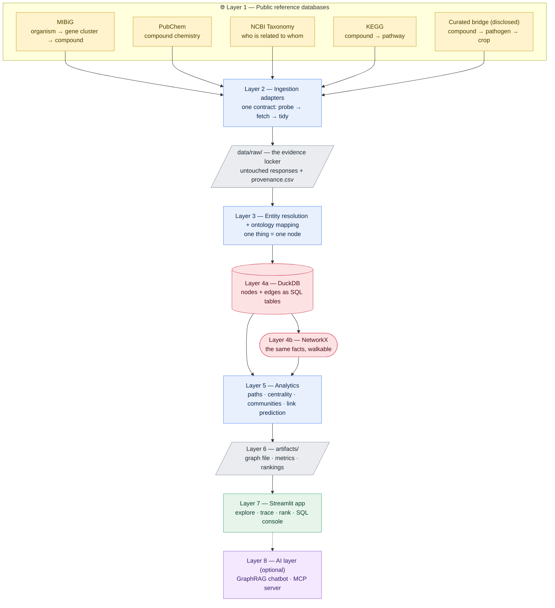

# 00 — Architecture: how MicrobeGraph fits together

**Prerequisites:** none. This is the first document. You do not need to have
installed anything, and you do not need any background in biology, programming,
or databases.

**Learning goal:** after reading this you will be able to explain, in your own
words, what every piece of MicrobeGraph is, why it exists, and how information
travels from a public website into a map you can ask questions of. You will also
understand the four words that scare beginners most — *backend*, *frontend*,
*database*, and *graph* — because each is defined here with an everyday example.

**Time:** 25–35 minutes of reading. No commands to run.

> Every term in this document is also in [`GLOSSARY.md`](GLOSSARY.md).

---

## Contents

1. [Why read an architecture document at all?](#1-why-read-an-architecture-document-at-all)
2. [The one-sentence version](#2-the-one-sentence-version)
3. [Four words, defined properly](#3-four-words-defined-properly)
4. [The full picture](#4-the-full-picture)
5. [Layer 1 — The sources](#5-layer-1--the-sources-where-facts-come-from)
6. [Layer 2 — Ingestion and the evidence locker](#6-layer-2--ingestion-and-the-evidence-locker)
7. [Layer 3 — Entity resolution](#7-layer-3--entity-resolution-deciding-two-names-are-one-thing)
8. [Layer 4 — Storage, twice on purpose](#8-layer-4--storage-twice-on-purpose)
9. [Layer 5 — Analytics](#9-layer-5--analytics-what-you-can-ask-a-map)
10. [Layer 6 — Artifacts: the bridge from laptop to cloud](#10-layer-6--artifacts-the-bridge-from-laptop-to-cloud)
11. [Layer 7 — The app](#11-layer-7--the-app-the-part-humans-touch)
12. [Layer 8 — The AI layer](#12-layer-8--the-ai-layer-optional-but-the-headline)
13. [Why this stack, and what we didn't pick](#13-why-this-stack-and-what-we-didnt-pick)
14. [How data actually flows: one fact's journey](#14-how-data-actually-flows-one-facts-journey)
15. [Design decisions, and the reasons behind them](#15-design-decisions-and-the-reasons-behind-them)
16. [Checkpoint](#16-checkpoint)

---

## 1. Why read an architecture document at all?

Imagine someone hands you a box of car parts and a very good instruction manual
for fitting each part. You could follow it perfectly and still have no idea what
a car *is* — what the engine is for, why there's a gearbox between it and the
wheels, why the fuel tank is at the back.

That's what happens when you start a software project by copying commands. You
get things working without understanding them, and the first time something
breaks you have nowhere to start.

So: this document is the picture on the jigsaw box. It is deliberately the
**first** thing in the tutorial, before any installation, because every later
step will make sense only if you already know which piece it is building.

**Read it once now. Read it again after Phase 3.** It will land differently the
second time, and that's normal.

---

## 2. The one-sentence version

> MicrobeGraph collects facts about microbes and molecules from public
> databases, decides which of those facts are about the same thing, stores them
> as a map of dots and arrows, and lets you walk the map to answer questions no
> single database can answer alone.

Everything below is that sentence, slowed down.

---

## 3. Four words, defined properly

These four appear constantly. Learn them once here and the rest of the tutorial
gets much easier.

### Database

A **database** is a program whose only job is to store information in an
organised way and answer questions about it quickly.

*Everyday example:* a library. Books are on shelves in a defined order, there's
a catalogue, and a librarian can find "all books by this author published after
2010" in seconds. A pile of books in a garage holds the same information but
answers no questions.

You ask a database questions in a language called **SQL** (say it "sequel" or
"ess-cue-ell"). SQL reads almost like English:

```sql
SELECT name FROM compounds WHERE activity = 'antifungal';
```

*Give me the name column, from the compounds table, for rows where the activity
is antifungal.* That's it. SQL is one of the most durable skills in data work —
it was invented in the 1970s and is still everywhere — and you will write your
first real SQL in Phase 3.

MicrobeGraph uses **DuckDB**, a database that is just a single file sitting in
your project folder. No server to install, no account, no password, no cost.

### Graph

A **graph** (in this sense — nothing to do with bar charts) is information
stored as **dots connected by arrows**.

*Everyday example:* the contacts in your phone are a table — one row per person,
columns for phone and email. A social network is a graph — people are dots,
"knows" is an arrow. The table is better for "what is Anna's number?". The graph
is better for "who do Anna and I both know?"

MicrobeGraph uses **NetworkX**, a free Python library for building and walking
graphs in memory.

Both DuckDB and NetworkX hold **the same facts**. See
[section 8](#8-layer-4--storage-twice-on-purpose) for why that's deliberate and
not wasteful.

### Backend

The **backend** is the part of a piece of software that does the real work,
where the user can't see it.

*Everyday example:* a restaurant kitchen. It buys ingredients, prepares them,
cooks, and plates the food. Customers never enter it. If the kitchen is good and
the dining room is ugly, the food is still good.

In MicrobeGraph, the backend is everything in `src/microbegraph/`: the code that
downloads records, cleans them, builds the graph, and runs the analysis.

### Frontend

The **frontend** is the part the user sees and touches: the buttons, the boxes,
the charts.

*Everyday example:* the restaurant's dining room and menu. It doesn't cook
anything. Its job is to let you express what you want and to present what comes
back, pleasantly.

In MicrobeGraph, the frontend is the **Streamlit app** in `app/`. It contains
almost no logic of its own; it calls the backend and draws the results.

**Why split them?** Three reasons, and they're the same reasons restaurants do
it. (1) You can rebuild the dining room without touching the recipes. (2) The
kitchen can serve many tables at once. (3) When a dish is wrong you know whether
to blame the cook or the waiter. In software this separation is what lets you
swap a Streamlit app for a website later without rewriting a single piece of the
science.

---

## 4. The full picture



**The shape to remember:** information flows *downward* and never loops back.
Each layer only ever reads from the layer above it. This is called a
**pipeline**, and it's the single most useful structural idea in data work.

*Everyday example of a pipeline:* a coffee shop. Beans → grinder → espresso
machine → cup. The grinder doesn't care where the beans were bought; the
espresso machine doesn't care which grinder was used. Each stage has one job,
one input, one output. If your coffee tastes wrong you can test each stage
separately.

The practical payoff: when something is wrong in MicrobeGraph, you don't debug
"the project". You ask *which layer* first, and you can inspect the output of
every layer independently.

---

## 5. Layer 1 — The sources: where facts come from

A **source** is a place on the internet that publishes data. Five feed this
project.

### MIBiG — the backbone

**What it is:** MIBiG stands for *Minimum Information about a Biosynthetic Gene
Cluster*. It is a public, community-curated repository of gene clusters that
scientists have **experimentally shown** produce a particular molecule.

**What's a gene cluster?** Think of a microbe's genome as a very long cookbook.
Most recipes are for everyday living. But sometimes several related recipe pages
sit right next to each other, and together they describe how to build one
specific, specialised molecule — a "production line" written into the DNA. That
run of neighbouring pages is a **biosynthetic gene cluster** (BGC).

**Why it's the backbone:** MIBiG is the only place that reliably gives us the
two arrows at the start of every chain — *this organism harbours this cluster*
and *this cluster produces this compound* — with a human curator's sign-off
behind each one.

**Licence:** CC-BY (free to use with attribution). Published on Zenodo with a
permanent DOI, so the exact version used is citable and reproducible.

### PubChem — the chemistry

Run by the US National Institutes of Health. Given a compound name it returns a
stable numeric identifier (a **CID**), a molecular formula, a weight, and a list
of synonyms.

**Why we need it:** two reasons. First, it makes compounds *comparable* — every
compound in the graph gets one canonical PubChem identity. Second, its synonym
lists are the raw material for entity resolution in Layer 3: PubChem is how we
learn that "surfactin" and "surfactin A" are the same molecule.

**Access:** free, no account, no key.

### NCBI Taxonomy — the family tree of life

Every named organism has a numeric **taxon ID** and a lineage: species → genus →
family → order → class → phylum → kingdom.

**Why we need it:** it lets a question like "*show me everything from the genus
Bacillus*" work even when the graph contains a dozen different Bacillus species
spelled inconsistently. The lineage is a ladder we can climb.

*Everyday example:* postal addresses. Street → city → region → country. If
someone asks "how many customers in Switzerland?" you don't need a Switzerland
column — you climb the ladder from each street address.

### UniProt — the proteins in between

**What it is:** the standard public reference for protein sequence and function,
free and comprehensive.

**Why we need it:** MIBiG tells you a gene cluster produces a compound. UniProt
tells you *which enzymes* do the work in between. Adding those makes the chain

```
Organism → GeneCluster → Protein → Compound → Pathogen → Crop
  (genomics)    (proteomics)   (metabolomics)  (phenotype)
```

— three different kinds of biological measurement joined into one structure a
single query can walk. That is what **multi-omics integration** means in practice,
as distinct from three tables sitting next to each other. It arrives in Phase 3.

**Access:** free, no account.

### KEGG — the pathway context

KEGG maps compounds to the biochemical **pathways** they take part in. A pathway
is a chain of chemical reactions a cell performs, like a production line with
named stations.

**Why we need it:** it adds a layer of *biological meaning* — two unrelated
compounds that turn out to sit in the same pathway are connected in a way pure
chemistry wouldn't show.

**Licence caution:** KEGG is free for academic use, requires attribution, and
must not be bulk-scraped. The adapter fetches only the specific compounds in our
graph, slowly and politely, and records the licence in the provenance log. This
is not paperwork — respecting a data source's terms is part of doing this
properly, and it is a habit worth building early.

### The curated bridge — the honest gap

Here is the hard truth of this project, stated plainly.

Nobody publishes a downloadable, machine-readable table saying *"compound X
suppresses pathogen Y on crop Z."* That knowledge lives in the prose of
scientific papers. It is exactly the link that makes the whole chain useful —
and it is exactly the link that isn't for sale.

Three ways to handle that:

1. **Pretend the gap doesn't exist** and build a graph that stops at the
   compound. Useless for the question we care about.
2. **Invent the links** and hope nobody checks. Dishonest, and instantly
   detectable by anyone who knows the field.
3. **Build the links by hand, cite every one, label them differently from the
   database facts, and let users filter them out.** ← *This is what MicrobeGraph
   does.*

Practically: a small CSV file in `curation/`, one row per fact, each with a
literature citation, each stamped `evidence_level = curated_literature`. It's
version-controlled like code, so its history is visible. It is small — dozens of
rows, not thousands — and that's stated everywhere it appears.

**Why this is the right choice:** in real data work you constantly meet gaps
where the ideal data doesn't exist. The professional move is never to hide the
gap; it's to fill it transparently, label the filling, and make it removable.
Being able to say *"here is exactly which part of my result rests on which kind
of evidence"* is more valuable than a bigger graph nobody can audit.

---

## 6. Layer 2 — Ingestion and the evidence locker

**Ingestion** just means "getting data in". Two ideas make this layer worth its
own design instead of five ad-hoc download scripts.

### Idea 1: one socket, many plugs

Every source has a different website, a different response format, and different
rules. If each got its own bespoke script, adding a sixth source would mean
inventing a sixth way of doing things, and the project would get harder to
extend over time rather than easier.

Instead, every source adapter promises the same three functions:

| Function | What it does | Everyday equivalent |
|---|---|---|
| `probe()` | Asks "how much is there?" without downloading it | Checking a parcel's weight before paying for shipping |
| `fetch()` | Downloads the raw response and saves it, unchanged | Photographing a receipt before filing it |
| `tidy()` | Turns that raw response into rows matching our data model | Typing the receipt's numbers into your budget spreadsheet |

That shared shape is called an **interface** or **contract**.

*Everyday example:* a wall socket. Your kettle, laptop charger, and lamp are
completely different machines, but every one of them ends in the same plug. The
socket doesn't need to know anything about kettles. Add a new appliance and it
just works — as long as it has the right plug.

The payoff arrives in Phase 2, when three new sources are added and *nothing
downstream changes*. That's not a coincidence; that's what the contract buys.

### Idea 2: the evidence locker

Every raw response is written to `data/raw/` and **never edited again**.
Everything downstream reads from that copy.

*Everyday example:* a scientist's lab notebook, or the original receipts behind
a tax return. You keep the original because if anyone ever asks "where did this
number come from?", you can show them — and because if you discover a mistake in
how you *interpreted* the receipts, you can redo the interpretation without
having to go shopping again.

Alongside the raw files sits `provenance.csv`: one row per fetch, recording
what was requested, from which source, when, how many records came back, and
under what licence. When someone asks "is this graph current?", the answer is a
file, not a guess.

**The rule that makes this work:** *never edit in place.* Cleaning always
produces a **new** copy. The evidence stays pristine. Every serious data
pipeline in the world follows this rule, and every beginner is tempted to break
it because editing in place feels tidier. It isn't — it's how you lose the
ability to check your own work.

---

## 7. Layer 3 — Entity resolution: deciding two names are one thing

This is the layer that separates a real knowledge graph from a toy one, so it
gets a proper explanation.

### The problem, in everyday terms

Imagine merging the contact lists of three people who all know your friend
Robert. One has "Robert Smith", one has "Bob Smith", one has "R. Smith
(work)". Three entries, one human. If you merge the lists naively you get three
Roberts, and every "who knows Robert?" question gives a fragmented answer.

Now scale that to science. The same molecule may appear as:

- `surfactin` (a common name in a paper)
- `surfactin A` (a specific variant)
- `CID 443324` (PubChem's number)
- `CHEBI:63863` (another database's number)

If these become four dots, the graph is silently broken. Every path through
"surfactin" splits four ways, every count is wrong, and nothing warns you.

**Entity resolution** is the process of deciding which records refer to the same
real-world thing, and merging them into one node.

### How MicrobeGraph does it

1. **Prefer an official identifier.** Where a source gives a stable ID (a
   PubChem CID, an NCBI taxon ID, a MIBiG accession), that ID *is* the identity.
   Numbers don't have spelling variants.
2. **Normalise text before comparing.** Lowercase, trim spaces, strip
   punctuation — so `Surfactin ` and `surfactin` stop being different.
3. **Use official synonym lists.** PubChem publishes them; matching a name
   against a synonym list is far safer than guessing from similarity.
4. **Write down every decision.** Each merge is recorded in a **resolution
   ledger**: what was merged, into what, and on what grounds.
5. **Refuse to guess.** If two names are similar but no source confirms they're
   the same, they stay separate and get flagged for review. A wrong merge is
   worse than a missed one, because a missed merge is visible (two dots where
   you expected one) while a wrong merge is invisible (one dot that quietly
   contains a lie).

That ledger is the deliverable, not just a log. It is the answer to "how do you
know these are the same thing?" — and being able to answer that question is the
difference between a graph people can rely on and a graph people can't.

---

## 8. Layer 4 — Storage, twice on purpose

The resolved facts are stored in **two** places: DuckDB (tables) and NetworkX (a
graph). Beginners reasonably ask: isn't that duplication a mistake?

No — and here's the intuition.

*Everyday example:* you have both a **timetable** and a **route map** for the
same train network. The timetable is a table: fast for "when does the 08:14
leave?" The route map is a graph: fast for "how do I get from here to there with
the fewest changes?" Same railway. Two representations. Nobody thinks having
both is wasteful, because each answers questions the other is bad at.

| Question | Best shape | Why |
|---|---|---|
| How many antifungal compounds are in the graph? | **Table** (SQL) | Counting rows that match a filter |
| Which sources contributed the most edges? | **Table** (SQL) | Grouping and summing |
| What's the shortest evidence chain from strawberry to a microbe? | **Graph** | Following arrows an unknown number of hops |
| Which compound, if removed, would disconnect the most chains? | **Graph** | Requires knowing the whole connection structure |
| Show every edge added since last month | **Table** (SQL) | Filtering by a date column |

**The rule that keeps them honest:** DuckDB is the **single source of truth**.
The NetworkX graph is *always* rebuilt from the DuckDB tables and never edited
directly. So there is one place facts live, and one place they're re-shaped. If
the two ever disagreed you'd have two versions of reality — the classic way
projects like this rot — so the build script makes disagreement structurally
impossible.

**DuckDB in one line:** a complete analytics database that is one file on your
laptop. No server, no account, no cost. It also happens to be the local
stand-in professionals use for cloud warehouses like Snowflake — the SQL you
write here transfers directly.

**NetworkX in one line:** a Python library that holds a graph in memory and
comes with decades of graph algorithms already written (shortest path,
centrality, community detection) so you don't implement them yourself.

---

## 9. Layer 5 — Analytics: what you can ask a map

Four families of question, each with an everyday parallel.

### Paths — "how do I get from A to B?"

The graph equivalent of route-finding. *"Show me the chain from strawberry back
to a microbe."* The answer is a sequence of arrows, and because each arrow
carries its source and evidence level, the answer is also its own bibliography.

This is MicrobeGraph's headline capability. It is what no single source database
can do.

### Centrality — "who are the important dots?"

*Everyday example:* in a city map, which junction would cause the most chaos if
it closed? Not necessarily the biggest — the one that the most routes pass
through.

Two flavours you'll use:

- **Degree centrality** — how many arrows touch this dot. The "popularity"
  measure. A compound produced by many organisms scores high.
- **Betweenness centrality** — how many shortest paths pass *through* this dot.
  The "bridge" measure. A compound that is the only known link between a group
  of microbes and a group of diseases scores high even with few arrows.

Betweenness is often the more interesting one, because bridges are where
knowledge is thin and where a single missing fact does the most damage.

### Communities — "which dots cluster together?"

*Everyday example:* in a social network, groups of friends emerge without anyone
labelling them — school friends here, colleagues there. **Community detection**
finds those clumps automatically.

In MicrobeGraph, communities tend to correspond to biological themes: a cluster
of related organisms making chemically related compounds against related
diseases. Finding a cluster the biology didn't predict is exactly the kind of
result worth investigating.

### Link prediction — "which arrow is probably missing?"

*Everyday example:* "People you may know." The network notices you share eleven
mutual friends with someone you're not connected to, and guesses you probably
know them.

Same logic here: if microbe A resembles microbes B and C in the compounds it
makes, and B and C both act on a pathogen that A has never been tested against,
that's a **plausible missing arrow** — a hypothesis worth a lab test.

**The honesty rule, stated firmly:** a predicted link is a *suggestion born of
resemblance*, not a finding. Every predicted edge is stored with
`evidence_level = inferred`, kept in a separate layer, drawn differently in the
app, and excluded by default from evidence chains. Prediction is the most
seductive part of this project and the easiest to overstate; the design makes
overstating it difficult.

---

## 10. Layer 6 — Artifacts: the bridge from laptop to cloud

An **artifact** here means a small file produced by the heavy work and read by
the app.

**Why this layer exists:** free app hosting gives you a small machine with
limited memory and a short patience for slow pages. Downloading from four
databases and recomputing graph metrics on every page load would be slow, would
hammer public services that are doing us a favour, and would break the moment a
source has an outage.

*Everyday example:* a restaurant's *mise en place*. The kitchen chops, portions,
and preps everything before service. During service, the cook assembles from
prepped components in ninety seconds. Same food, radically different speed —
because the slow work happened earlier, once.

So the heavy work runs on your laptop and writes:

- `artifacts/graph.graphml` — the built graph in a portable standard format
- `artifacts/node_metrics.csv` — centrality scores per node
- `artifacts/candidate_rankings.csv` — the predicted links, with scores

These are small, so they're committed to Git, so the deployed app has them
immediately. The app becomes a *reader*, which is exactly why it can be free,
fast, and reliable.

---

## 11. Layer 7 — The app: the part humans touch

Built with **Streamlit**, a Python library that turns a plain script into a web
app with buttons, dropdowns, and charts — no web development needed.

*Everyday example:* Streamlit is a car with automatic transmission. A manual
gearbox (writing HTML, CSS, and JavaScript by hand) gives you total control and
takes months to learn. Automatic gets you driving today. Both get you there;
pick based on the journey.

Four planned areas:

1. **Explore** — see the map, filter by node type, source, or evidence level.
2. **Trace** — pick a disease or a microbe and see the evidence chains, with
   every arrow's source shown.
3. **Rank** — pick a pathogen and get candidate microbes, scored, with the
   "why" spelled out and the inferred edges clearly marked.
4. **Query** — a read-only SQL console, so anyone can ask their own question of
   the underlying tables. *Read-only* means the console can look but never
   change or delete: a hard rule enforced in code, not a promise in the docs.

Because the app is a thin frontend over a real backend, replacing Streamlit with
a full website later would not touch a single line of the science. That option
is in the roadmap, deliberately not the starting point.

---

## 12. Layer 8 — The AI layer: optional, but the headline

Two features, both built on the same graph, and both explained from zero when
their phases arrive.

### GraphRAG — answering questions by walking the map

Start with the problem. A **large language model** (LLM) — the technology behind
chat assistants — is excellent at language and unreliable at facts. Asked a
specific scientific question, it may produce a confident, well-written, entirely
invented answer. That's called a **hallucination**, and in a scientific context
it is disqualifying.

**RAG** (Retrieval-Augmented Generation) is the standard fix, and it's simpler
than the acronym suggests: *before* the model answers, go and fetch the relevant
real information, hand it to the model, and instruct it to answer **only** from
what it was given.

*Everyday example:* the difference between asking a well-read friend a question
from memory versus handing them the exact page from the manual and asking them
to explain what it says. Same friend, dramatically more reliable answer.

**GraphRAG** is RAG where the fetched information comes from **walking a
knowledge graph** rather than searching documents. Ask *"which microbes might
help against grey mould on strawberries?"* and the system:

1. finds the `Botrytis cinerea` node,
2. walks backwards along `INFECTS` ← `INHIBITS` ← `PRODUCES` ← `HARBORS`,
3. collects the chains it finds, with their sources and evidence levels,
4. hands only those chains to the language model,
5. asks it to write the answer in plain English, citing what it was given.

**Why it's better than plain RAG here:** the relationships *are* the answer.
Document search would return paragraphs that each mention one link; the graph
returns the assembled chain. And because every arrow carries its provenance, the
answer arrives with its own footnotes.

**Graceful degradation** is designed in from the start: no API key configured →
the feature hides itself and everything else still works. The app must never
require a paid service to be useful.

### MCP server — a safe door for AI assistants

**MCP** (Model Context Protocol) is an open standard for letting an AI assistant
plug into an external tool or data source.

*Everyday example:* USB. Before USB, every device needed its own connector and
its own driver. USB is one agreed shape, so any device works with any computer.
MCP is that agreement for AI assistants and tools.

Wrapping MicrobeGraph as a small MCP server means an assistant can ask the graph
real questions — *find the path*, *rank candidates for this pathogen*, *show the
evidence* — and get real, sourced answers instead of guesses.

The server will expose **read-only** tools with fixed, validated inputs. It can
look up; it cannot alter, delete, or fetch. Scope is a security decision, and
narrow scope is the design, not a limitation.

By the time the MCP server is built (Phase 16), the FastAPI service layer from
Phase 14 already exposes exactly these operations — so MCP becomes a thin wrapper
rather than a second implementation. That ordering is why the roadmap puts the API
first.

---

## 13. Why this stack, and what we didn't pick

Every tool here is free and cross-platform. For each: what it is, why it fits,
and the honest alternative.

| Tool | What it is (plain language) | Why it wins here | What we didn't pick, and why |
|---|---|---|---|
| **Python** | A general-purpose programming language known for readable code | Every library this project needs exists in Python, and it's the same language end to end — one language to learn, not four | R is superb for statistics but has thinner graph and app tooling; JavaScript is superb for interfaces but weaker for data work |
| **NetworkX** | A Python library that holds a graph in memory with the classic algorithms built in | Zero setup, runs identically on every OS, and graphs of this size fit comfortably in memory | **Neo4j** is a proper graph database with its own query language — better at scale, but it means installing and running a server before you've learned what a graph *is*. It's the roadmap item, not the starting line |
| **DuckDB** | An analytics database that is a single file | Real SQL with no server, no account, no cost; the SQL transfers directly to cloud warehouses | **SQLite** is simpler but weaker at analytical queries; **PostgreSQL** is a full server — real setup burden for no benefit at this size |
| **requests** | The standard Python library for fetching things over the internet | Simple, universal, and does exactly one job well | Heavier HTTP frameworks add complexity we'd never use |
| **pandas** | A library for working with tables in Python — "programmable Excel that never gets tired" | The universal shape for tabular data in Python; every other library speaks it | Plain Python lists work but you'd rewrite pandas badly |
| **Streamlit** | Turns a Python script into a web app | Fastest honest path from analysis to something clickable; free public hosting | **React** gives a polished custom interface at the cost of learning a second language and a build system — roadmap, not core |
| **R + igraph** | A language built by statisticians, and its graph library | Phase 6 asks "could this pattern have arisen by chance?" — R's tooling for that is more direct and better documented. It also gives an independent second implementation to check the Python results against | Doing the statistics in Python would work; it would just mean one implementation checking itself, which validates nothing |
| **ggplot2** | R's plotting library, layer by layer | Best-in-class static, publication-quality figures for the docs | `matplotlib` is used for quick Python-side charts; both are kept, each where it's stronger |
| **pytest** | Runs small automated checks that prove your code does what you claim | Catches your own mistakes before your users do; a graph built by untested code is a graph you can't trust | Python's built-in `unittest` works but is clunkier |
| **Git + GitHub** | A save-game system for your work, and its online home | The universal standard; the branch model (`master`/`beta`/`develop`) is set up in Phase 0 | Nothing else is worth considering |
| **venv** | A sealed toolbox of packages belonging to this project only | Stops projects breaking each other; makes the setup reproducible on any machine | **conda** is heavier; **Docker** is a superb answer to a problem we don't have yet |

### What arrives later, and what triggers it

Release 1.0 (above) deliberately uses the smallest stack that does the job well.
Release 2.0 and 3.0 add a production tier **alongside** it — never replacing it —
and each tool arrives at the point the project grows a real need for it:

| Tool | Arrives at | The need that triggers it |
|---|---|---|
| **dbt** | Phase 10 | The ontology's validation rules *are* dbt's built-in tests (`unique`, `relationships`, `accepted_values`, `not_null`). The rulebook becomes a `schema.yml` |
| **PostgreSQL + Apache AGE + pgvector** | Phase 11 | Three needs converge: a real graph database with Cypher, a vector store for RAG, and an application database for the API. One engine, three jobs |
| **Airflow** | Phase 12 | Five sources, strict dependency order, a monthly refresh, retries, alerts. That list is Airflow's job description |
| **Docker / Podman** | Phase 12 | Airflow is several cooperating services — the situation containers exist for. Three routes documented, including a container-free one |
| **Snowflake** | Phase 13 | Not a need — a *demonstration*. The same dbt models running against a cloud warehouse with only a target change |
| **FastAPI** | Phase 14 | Streamlit, React and MCP all need the same query logic. Write it once or write it three times |
| **React + TypeScript** | Phase 15 | A public product distinct from the analyst's workbench — and there is finally an API to build against |
| **MCP server** | Phase 16 | A thin, standardised wrapper over an API that already exists. Hours of work for a capability few projects have |
| **Databricks** | Phase 17 | The one genuinely compute-heavy job: mining thousands of paper abstracts. **Honestly the weakest-fit tool in the plan**, and placed last for that reason |

**Considered and rejected, with reasons:** **Neo4j** (Apache AGE gives Cypher
inside a database the project needs anyway — a second graph server would mean a
second data copy and a sync problem), **Kubernetes** (no scale to justify it),
**Kafka/streaming** (sources update monthly; batch is the correct design, not a
compromise), **deep learning for the core prediction** (small graph, and
explainability is the entire point).

*Choosing not to use a fashionable tool, and being able to say exactly why, is a
skill in itself.* Full reasoning for every phase: [`ROADMAP.md`](ROADMAP.md).

---

## 14. How data actually flows: one fact's journey

Follow a single fact through every layer. This is the whole architecture in one
story.

**The fact:** *Bacillus velezensis carries a gene cluster that produces
surfactin.*

| Step | Layer | What happens | Where it lands |
|---|---|---|---|
| 1 | Source | A curator publishes a MIBiG entry recording the experiment | mibig.secondarymetabolites.org |
| 2 | Ingestion — `probe()` | We ask how many entries exist, without downloading | Printed to your terminal, free |
| 3 | Ingestion — `fetch()` | The entry's JSON is downloaded and saved **unchanged** | `data/raw/mibig/BGC0000XXX.json` |
| 4 | Ingestion — provenance | A row records the source, time, count, and licence | `data/raw/provenance.csv` |
| 5 | Ingestion — `tidy()` | The JSON is parsed into rows shaped like our data model | in memory |
| 6 | Resolution | "Bacillus velezensis" → NCBI taxon ID; "surfactin" → PubChem CID; aliases merged | resolution ledger |
| 7 | Storage (truth) | Two nodes and two edges are written, each with source and evidence level | `microbegraph.duckdb` |
| 8 | Storage (shape) | The same rows are loaded as dots and arrows | NetworkX graph in memory |
| 9 | Analytics | Surfactin turns out to sit on many shortest paths — high betweenness | `artifacts/node_metrics.csv` |
| 10 | Artifacts | The graph and metrics are saved as small files | `artifacts/` |
| 11 | App | A user searching "grey mould" sees a chain passing through surfactin | the browser |
| 12 | AI layer | GraphRAG hands that chain to a language model, which explains it in plain English, citing the MIBiG accession | the browser |

Notice what's true at every step: **you can stop and look**. Each layer's output
is a file or a table you can open. That's not an accident — it's what makes a
pipeline debuggable, and it's why the layers exist in the first place.

---

## 15. Design decisions, and the reasons behind them

The decisions that shaped this architecture, each with its reason. Understanding
*why* a thing was built this way is more valuable than knowing *that* it was.

1. **The ontology is written before any pipeline code.** A graph assembled
   without a written contract about what may be a node and what may be an arrow
   becomes an unqueryable tangle within a week. The rulebook is
   [`02-ontology-and-data-model.md`](02-ontology-and-data-model.md).
2. **Raw responses are never edited.** Cleaning always writes a new copy. This
   is what makes "where did this number come from?" answerable months later.
3. **Every edge carries its evidence level.** A graph that mixes measured and
   guessed facts without marking which is which is worse than no graph, because
   it looks authoritative.
4. **DuckDB is the single source of truth; the graph is rebuilt from it.** One
   place facts live; two shapes to query them. Disagreement is made structurally
   impossible.
5. **The heavy work runs on the laptop; the app reads small files.** Keeps the
   public deployment fast, free, resilient to source outages, and polite to
   public services.
6. **The AI layer is optional and degrades gracefully.** Without an API key
   everything else still works. A project that requires a paid service to
   demonstrate anything is a fragile project.
7. **Predicted links live in their own layer.** They can be shown, hidden, or
   exported separately, and are never silently mixed into evidence chains.
8. **Everything is cross-platform Python.** The project runs identically on
   Windows, macOS, and RHEL 8 Linux, with no compiled dependencies, no
   OS-specific tools, and platform-neutral file paths throughout.
9. **The data format is language-neutral, so the language is a per-task choice.**
   DuckDB has clients for Python and R, so both read the *same file* with no
   export step. That is why R can do the statistics without a second copy of the
   truth existing anywhere. When data lives in a shared, open format, choosing a
   language stops being a lock-in decision.
10. **Containers are an additional path, never a required one.** The whole
   application can be packaged and run with one command (Phases 9b and 18, under
   either Docker or Podman) — but the plain `.venv` path stays supported forever,
   so a fresh clone works for someone who doesn't want a container engine at all.
   The container files are written once and work with both engines rather than
   maintaining two configurations: see
   [`CONTAINERIZATION.md`](CONTAINERIZATION.md).

---

## 16. Checkpoint

You've finished this document when you can answer these without scrolling up.
Try them honestly — write your answers down, then check.

1. What is the difference between a node and an edge?
2. Why does MicrobeGraph store the same facts in both DuckDB and NetworkX?
3. What is the evidence locker, and what rule protects it?
4. What is entity resolution, and why is a *wrong* merge worse than a *missed*
   one?
5. Which layer would you inspect first if the app showed a compound with no
   connections at all?
6. Why is a predicted link labelled `inferred` and kept in its own layer?
7. In one sentence each: backend, frontend, database, graph.

<details>
<summary>Answers (open after you've tried)</summary>

1. A node is a thing (a microbe, a compound); an edge is a directed, named
   relationship between two things (*produces*, *inhibits*).
2. Tables are best at counting, filtering, and grouping; graphs are best at
   following chains of unknown length. Same facts, two shapes, different
   questions. DuckDB stays the single source of truth.
3. `data/raw/` — the untouched original responses from every source, plus
   `provenance.csv`. The rule: never edit in place; cleaning always writes a new
   copy.
4. Deciding which records refer to the same real-world thing and merging them.
   A missed merge is visible (two dots where you expected one); a wrong merge is
   invisible (one dot quietly containing a falsehood).
5. Layer 3 (entity resolution) — the most likely cause is that the compound's
   aliases weren't merged, so its arrows attached to a different copy of it.
   Second place: Layer 2, if a source's `tidy()` step dropped rows.
6. Because it comes from resemblance, not observation. Separating it means a
   user can always ask "show me only what is actually known", and predictions can
   never be mistaken for measurements.
7. Backend = the kitchen, where the work happens out of sight. Frontend = the
   dining room, where people order and receive. Database = the organised library
   with a fast librarian. Graph = the route map of dots and arrows.

</details>

**If some answers were shaky, that's expected on a first read.** Continue to
setup anyway — the concepts land much better once you've run something. Come
back to this document after Phase 3 and it will read very differently.

---

## Committing this phase

Every phase in this tutorial ends by saving your work to GitHub. If you haven't
set up Git yet, that's the next document — skip this box for now and come back.

```bash
git switch develop
git add -A
git commit -m "docs: add architecture overview"
git push origin develop develop:beta develop:master

# bring local master back in step with the remote master just updated
git switch master
git pull --ff-only origin master
git switch develop
```

Every line of that block is explained in [`01-setup.md`](01-setup.md).

---

**Next:** [`01-setup.md`](01-setup.md) — turning a blank laptop into a working
workshop, on Windows, macOS, or RHEL 8 Linux.
