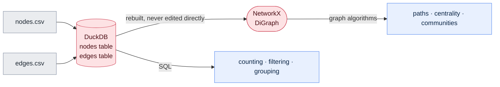

# 02 — The ontology and data model: the rulebook

**Prerequisites:** [`00-architecture.md`](00-architecture.md) (you should know
what a node and an edge are) and [`01-setup.md`](01-setup.md) (a working
repository on the `develop` branch). No biology or database background needed.

**Learning goal:** you will understand what an *ontology* is, why writing one
before any pipeline code is the single most important decision in a graph
project, and you will be able to read the complete MicrobeGraph schema — every
node type, every edge type, every column, and the evidence system that makes the
graph trustworthy.

**Time:** 30–40 minutes reading, ~15 minutes writing the two files at the end.

> Every term here is also in [`GLOSSARY.md`](GLOSSARY.md).

---

## Contents

1. [Why a rulebook, and why now](#1-why-a-rulebook-and-why-now)
2. [What an ontology actually is](#2-what-an-ontology-actually-is)
3. [Identifiers: the CURIE convention](#3-identifiers-the-curie-convention)
4. [The node types](#4-the-node-types-the-nouns)
5. [The edge types](#5-the-edge-types-the-verbs)
6. [Evidence: the column that makes the graph honest](#6-evidence-the-column-that-makes-the-graph-honest)
7. [The physical schema: two CSV files](#7-the-physical-schema-two-csv-files)
8. [How it becomes SQL tables and a graph](#8-how-it-becomes-sql-tables-and-a-graph)
9. [Validation rules the loader enforces](#9-validation-rules-the-loader-enforces)
10. [A worked example: one chain, end to end](#10-a-worked-example-one-chain-end-to-end)
11. [Design decisions and their reasons](#11-design-decisions-and-their-reasons)
12. [Write the files](#12-write-the-files)
13. [Checkpoint](#13-checkpoint)

---

## 1. Why a rulebook, and why now

Here is the failure mode this document exists to prevent, and it is extremely
common.

You start collecting facts. MIBiG gives you organisms and compounds, so you add
those. PubChem gives you molecular weights, so you add a "weight" thing. A paper
mentions a pathogen, so you add pathogens. Somewhere along the way, one script
writes organism names as `Bacillus velezensis` and another writes
`bacillus_velezensis`. One writes the relationship as `produces`, another as
`makes`. Compounds are sometimes nodes and sometimes just a text column on
another node.

Three weeks in, nothing joins to anything. You can't count reliably. You can't
walk a path because half the arrows have the wrong name. And the fix isn't a bug
fix — it's a rebuild, because the problem is in the *shape*, not the code.

*Everyday example:* a shared address book where one person writes phone numbers
as `+41 79 123 45 67`, another as `0791234567`, and a third as
`079-123-45-67`. Every individual entry is fine. Collectively it's unsearchable.
The fix isn't better typing — it's agreeing the format first.

**So: decide the shape first, write it down, and make the loader refuse anything
that doesn't fit.** That written agreement is the ontology, and this document is
it.

*This is also, quietly, the most professional habit in the whole project.
Deciding your data model before writing pipeline code is what separates a system
from a pile of scripts.*

---

## 2. What an ontology actually is

The word sounds forbidding. The idea is simple.

An **ontology** is a written agreement about **what kinds of things exist in
your world, and what kinds of relationships are allowed between them.**

*Everyday example — a family tree.* Before you can draw one, you need to agree
what kinds of things appear (people) and what relationships are allowed
(*parent-of*, *married-to*, *sibling-of*). You'd never draw an arrow labelled
"borrowed-a-lawnmower-from", not because it's untrue, but because it isn't part
of what a family tree is *for*. The ontology is that decision, made explicitly.

*Second everyday example — a restaurant menu.* A menu has categories (starters,
mains, desserts) and rules (a dessert has a price, a main has a description, a
wine has a vintage). You can't order a "starter" that is secretly a wine. The
categories and their rules are the menu's ontology.

*Third — a library catalogue.* Things: Book, Author, Publisher, Subject.
Relationships: an Author *wrote* a Book; a Publisher *published* a Book; a Book
*is-about* a Subject. That small set of nouns and verbs is what lets you ask
"which subjects does this author cover?" — a question no single book contains
the answer to.

An ontology therefore has two halves:

- **Node types** — the *nouns*: what kinds of things can be a dot.
- **Edge types** — the *verbs*: what kinds of arrows are allowed, and between
  which nouns.

And one rule that does most of the work: **if a fact doesn't fit the nouns and
verbs, it doesn't go in.** Either you extend the ontology deliberately — in a
commit, with a reason — or you leave the fact out. What you never do is quietly
bend an existing type to hold something it wasn't meant for.

### Ontology vs schema vs data model

You'll hear all three words. In practice, for a project this size:

- **Ontology** — the conceptual agreement: these nouns, these verbs, these
  rules. Language-independent.
- **Schema** — the concrete implementation: these columns, these types, these
  constraints.
- **Data model** — used loosely for either or both.

This document contains all of it, which is why the filename says
"ontology-and-data-model".

---

## 3. Identifiers: the CURIE convention

Every node needs an **identifier** — a name that is unique across the whole
graph and never changes.

### Why names won't do

"Surfactin" is not a safe identifier. It gets written `surfactin`, `Surfactin`,
`surfactin A`, `Surfactin C15`. Text drifts. Numbers from an authority don't.

But raw numbers have the opposite problem: `443324` is unique in PubChem and
meaningless everywhere else. Taxon `1390` and PubChem compound `1390` are
completely different things.

### The fix: prefix the number with where it came from

A **CURIE** (*Compact URI*, pronounced "curie") is just `prefix:localid`:

```
pubchem.compound:443324      ← the compound surfactin, in PubChem's numbering
ncbitaxon:1390               ← the organism Bacillus subtilis, in NCBI's numbering
mibig:BGC0000433             ← a gene cluster, in MIBiG's numbering
```

*Everyday example:* international phone numbers. `079 123 45 67` is ambiguous
worldwide; `+41 79 123 45 67` is not, because the country code says whose
numbering system it belongs to. The prefix is the country code for data.

This is a real, widely-used standard, not something invented here — the same
convention used across biological and linked-data systems.

### The prefixes MicrobeGraph uses

| Prefix | Authority | Example | Used for |
|---|---|---|---|
| `ncbitaxon` | NCBI Taxonomy | `ncbitaxon:1390` | Organisms and pathogens |
| `mibig` | MIBiG | `mibig:BGC0000433` | Gene clusters |
| `pubchem.compound` | PubChem | `pubchem.compound:443324` | Compounds |
| `kegg.pathway` | KEGG | `kegg.pathway:map01110` | Pathways |
| `uniprot` | UniProt | `uniprot:P27206` | Proteins (enzymes) |
| `mg.class` | *this project* | `mg.class:lipopeptide` | Compound classes |
| `mg.activity` | *this project* | `mg.activity:antifungal` | Biological activities |
| `mg.crop` | *this project* | `mg.crop:strawberry` | Crops |

**Note the honesty built into the prefixes.** `mg.` marks the things *this
project* invented because no public authority numbers them. Anyone reading the
graph can tell at a glance which identifiers come from an external authority and
which are ours. That distinction is not decoration — it tells a reader exactly
how much external weight an identifier carries.

**Rule:** prefer an authority prefix wherever one exists. Only mint an `mg.`
identifier when nothing external covers the concept, and keep those to a short,
controlled list defined in this document.

---

## 4. The node types (the nouns)

Nine types. Each gets a plain-language definition, an everyday parallel, its
identifier scheme, and its properties.

### 1. `Organism`

**What it is:** a microbe — a bacterium, fungus, or yeast — that produces
something interesting. *The factory.*

**Identifier:** `ncbitaxon:<taxid>`, or `mg.organism:<slug>` when a MIBiG record
names a strain that has no NCBI entry.

| Property | Type | Meaning |
|---|---|---|
| `name` | text | Scientific name, e.g. `Bacillus velezensis` |
| `rank` | text | `species`, `genus`, `strain` |
| `lineage` | text | `Bacteria; Firmicutes; Bacilli; ...` — the full ladder |
| `kingdom` | text | `Bacteria`, `Fungi`, `Other` |

### 2. `GeneCluster`

**What it is:** a run of neighbouring genes that together build one specialised
molecule. *The production line inside the factory.*

**Identifier:** `mibig:<accession>`

| Property | Type | Meaning |
|---|---|---|
| `name` | text | Cluster name if given |
| `bgc_class` | text | `NRPS`, `PKS`, `Terpene`, ... — the machinery type |
| `completeness` | text | Whether the cluster is fully characterised |

### 3. `Protein`

**What it is:** an enzyme encoded by the gene cluster — the actual molecular
machine that performs one chemical step. *The machine standing on the production
line.*

**Identifier:** `uniprot:<accession>`, or `mg.protein:<slug>` where UniProt has no
entry.

**Why this node type matters:** it is what turns MicrobeGraph from two molecular
layers into three. With `Protein` in place, the chain reads
**genomics → proteomics → metabolomics → phenotype** — three different kinds of
biological measurement, joined into one structure a single query can walk. That
is what "multi-omics integration" means in practice, as opposed to three tables
sitting next to each other.

| Property | Type | Meaning |
|---|---|---|
| `name` | text | Protein name, e.g. `surfactin synthase SrfAA` |
| `ec_number` | text | Enzyme Commission number — the standard code for what reaction it performs |
| `length` | number | Number of amino acids |
| `function` | text | UniProt's short functional description |

### 4. `Compound`

**What it is:** the molecule produced. *The product coming off the line.*

**Identifier:** `pubchem.compound:<CID>`, or `mg.compound:<slug>` if PubChem has
no entry (recorded honestly, not hidden).

| Property | Type | Meaning |
|---|---|---|
| `name` | text | Preferred name, e.g. `surfactin` |
| `synonyms` | text | Pipe-separated alternatives — the raw material for resolution |
| `formula` | text | e.g. `C53H93N7O13` |
| `mol_weight` | number | Molecular weight |

### 5. `CompoundClass`

**What it is:** a family of chemically related compounds. *The product
category.*

**Identifier:** `mg.class:<slug>` — e.g. `mg.class:lipopeptide`

*Everyday example:* in a supermarket, "surfactin" is one product and
"lipopeptide" is the aisle. Aisles let you ask "what else is like this?" without
knowing every product name.

| Property | Type | Meaning |
|---|---|---|
| `name` | text | e.g. `lipopeptide`, `polyketide`, `siderophore` |
| `description` | text | One plain-language line |

### 6. `Activity`

**What it is:** what a compound *does* biologically. *The product's job
description.*

**Identifier:** `mg.activity:<slug>` — e.g. `mg.activity:antifungal`

| Property | Type | Meaning |
|---|---|---|
| `name` | text | `antifungal`, `antibacterial`, `siderophore`, `surfactant` |
| `description` | text | One plain-language line |

### 7. `Pathogen`

**What it is:** an organism that causes plant disease. *The problem.*

**Identifier:** `ncbitaxon:<taxid>`

**Why separate from `Organism`?** Both are living things, and a purist would
model "pathogen" as a *role* rather than a *type*. We keep them as separate node
types for one practical reason: it makes every question in this project simpler
to ask and every diagram simpler to read. The whole graph is oriented around
"helpful organism → molecule → harmful organism → crop", and collapsing the two
ends into one type would mean every single query needs a role filter.

**The honest trade-off:** if an organism were ever both (some are), this model
would need it twice. That case doesn't arise in our current scope, and the
decision is recorded here so a future reader knows it was a choice, not an
oversight. *Documenting the limits of your model is part of the model.*

| Property | Type | Meaning |
|---|---|---|
| `name` | text | e.g. `Botrytis cinerea` |
| `common_name` | text | e.g. `grey mould` |
| `pathogen_type` | text | `fungus`, `oomycete`, `bacterium` |

### 8. `Crop`

**What it is:** a cultivated plant that gets infected. *Who suffers.*

**Identifier:** `mg.crop:<slug>` — e.g. `mg.crop:strawberry`

| Property | Type | Meaning |
|---|---|---|
| `name` | text | Common name |
| `scientific_name` | text | e.g. `Fragaria × ananassa` |
| `category` | text | `fruit`, `cereal`, `vegetable` |

### 9. `Pathway`

**What it is:** a chain of biochemical reactions a cell performs. *The wider
production process the product belongs to.*

**Identifier:** `kegg.pathway:<id>`

| Property | Type | Meaning |
|---|---|---|
| `name` | text | Pathway name |
| `category` | text | KEGG's top-level grouping |

---

## 5. The edge types (the verbs)

Ten types. **Every edge has a direction** — `A --produces--> B` is not the
same statement as `B --produces--> A`, exactly as "Anna is Ben's mother" differs
from the reverse.

| Edge type | From → To | Reads as | Where it comes from |
|---|---|---|---|
| `HARBORS` | Organism → GeneCluster | *this microbe carries this production line* | MIBiG |
| `ENCODES` | GeneCluster → Protein | *this production line specifies this enzyme* | UniProt |
| `CATALYZES` | Protein → Compound | *this enzyme performs a step making this molecule* | UniProt |
| `PRODUCES` | GeneCluster → Compound | *this production line makes this molecule* (the direct shortcut) | MIBiG |
| `BELONGS_TO` | Compound → CompoundClass | *this molecule is one of these* | MIBiG / curated |
| `HAS_ACTIVITY` | Compound → Activity | *this molecule does this* | MIBiG / curated |
| `INHIBITS` | Compound → Pathogen | *this molecule suppresses this pathogen* | **curated bridge** |
| `INFECTS` | Pathogen → Crop | *this pathogen attacks this crop* | **curated bridge** |
| `PARTICIPATES_IN` | Compound → Pathway | *this molecule takes part in this process* | KEGG |
| `MEMBER_OF` | Organism → Organism | *this species belongs to this genus* | NCBI Taxonomy |

### The chain this is all built for

```
Organism --HARBORS--> GeneCluster --PRODUCES--> Compound --INHIBITS--> Pathogen --INFECTS--> Crop
                           |                       ^
                       ENCODES                 CATALYZES
                           v                       |
                        Protein --------------------
```

The **top row** is the fast path: MIBiG states directly that a cluster produces a
compound, so traversal is short. The **lower branch** is the mechanistic path
through the enzymes, added in Phase 3 from UniProt.

Both are kept on purpose, because they answer different questions — the shortcut
is for "which microbe makes this?", the protein path is for "*how*?". Keeping a
redundant shortcut is a real modelling decision with a real trade-off (two routes
must stay consistent), and it is recorded here rather than left for a future
reader to puzzle over.

Reading only the top row:

Read forwards: *this microbe carries a production line that makes a molecule
that suppresses a pathogen that attacks this crop.*

Read **backwards** — the direction that makes the project useful: *start at a
crop, find its diseases, find molecules that act on them, find the production
lines that make those molecules, find the microbes that carry them.*

Five arrows. Four different databases. One query.

### Why `MEMBER_OF` points organism → organism

This is the only edge whose two ends are the same type, and it's what makes
taxonomy work. *Bacillus velezensis* `MEMBER_OF` *Bacillus* (the genus). Chain
those and you get the full lineage as a walkable ladder, so "show me everything
from the genus *Bacillus*" becomes "walk down from the genus node" — no special
code, no lineage-parsing, just the same arrow-following as everything else.

*Everyday example:* folders inside folders. A folder can contain a folder. That
one rule gives you unlimited depth without any new concept.

---

## 6. Evidence: the column that makes the graph honest

**Every edge carries where it came from and how strong that is.** This is the
part of the design worth defending hardest.

### Why it's non-negotiable

A fact a curator verified from a published experiment, and a fact an algorithm
guessed from resemblance, look **identical** once they're arrows on a screen.
Both are a line between two dots. If the graph doesn't distinguish them, it
*averages* them — and an average of "measured" and "guessed" is just "unknown",
presented confidently.

*Everyday example:* a recipe that doesn't distinguish "I measured 200g" from "I
reckon about 200g". Fine when you wrote it. Useless to anyone else, and useless
to you in a year.

### The four evidence levels

| Level | Meaning | Example | How to treat it |
|---|---|---|---|
| `curated_experimental` | A curator recorded a published experiment | A MIBiG entry where the compound was isolated and identified | Strongest available |
| `database_assertion` | A public database states it | PubChem's molecular formula; NCBI's lineage | Reliable reference data |
| `curated_literature` | **This project's own reading of a paper**, cited | An `INHIBITS` edge from the bridge layer | Trustworthy but ours — check the citation |
| `inferred` | Produced by an algorithm in this repo | A predicted link from Phase 5 | **A hypothesis. Never a finding.** |

### What the levels buy you

Because the level is a column, not a footnote:

- **Filtering is a feature.** "Show me only what is actually known" is a
  checkbox, not a rewrite.
- **Evidence chains are auditable.** A path is only as strong as its weakest
  arrow, and the app can say so explicitly.
- **Predictions can never leak.** Inferred edges are excluded from evidence
  chains by default and drawn differently.
- **You can measure your own graph.** "62% of edges are
  `database_assertion`, 4% are `inferred`" is a real quality metric you can
  report and track over time.

### The other provenance columns

| Column | Why it exists |
|---|---|
| `source` | Which database or file this came from — `mibig`, `pubchem`, `curation` |
| `source_record_id` | The exact record, so anyone can go and look |
| `retrieved_at` | When. Databases change; "as of" is part of the fact |
| `confidence` | 0–1. Set by the source adapter; used for ranking, never for hiding |
| `citation` | For `curated_literature` edges: the DOI or reference. **Required** |

**A rule with teeth:** an edge with `evidence_level = curated_literature` and an
empty `citation` is **rejected by the loader**. Not warned about — rejected. An
uncited hand-added fact is exactly the thing that erodes trust in a graph, so
the schema makes it impossible rather than discouraged.

---

## 7. The physical schema: two CSV files

The whole graph is two files. That's deliberate — a graph you can open in a text
editor is a graph you can debug.

### `data/processed/nodes.csv`

One row per dot.

| Column | Type | Required | Meaning |
|---|---|---|---|
| `node_id` | text | ✅ | CURIE — unique across the entire file |
| `node_type` | text | ✅ | One of the eight types |
| `name` | text | ✅ | Human-readable label |
| `properties` | JSON text | | Type-specific extras, as `{"key": "value"}` |
| `source` | text | ✅ | Where this node came from |
| `retrieved_at` | date | ✅ | When |

Example rows:

```csv
node_id,node_type,name,properties,source,retrieved_at
ncbitaxon:1390,Organism,Bacillus subtilis,"{""rank"":""species"",""kingdom"":""Bacteria""}",ncbi,2026-08-28
mibig:BGC0000433,GeneCluster,surfactin BGC,"{""bgc_class"":""NRPS""}",mibig,2026-08-28
pubchem.compound:443324,Compound,surfactin,"{""formula"":""C53H93N7O13""}",pubchem,2026-08-28
ncbitaxon:40559,Pathogen,Botrytis cinerea,"{""common_name"":""grey mould""}",ncbi,2026-08-28
mg.crop:strawberry,Crop,strawberry,"{""category"":""fruit""}",curation,2026-08-28
```

**Why a JSON blob for `properties` instead of a column per property?** Because
the eight node types need different properties, and one wide table with a column
for every property of every type would be mostly empty. A JSON column keeps the
file narrow and readable, and DuckDB can query inside JSON when you need it.
*The trade-off, stated honestly:* querying inside JSON is slightly more
awkward than a plain column. For the handful of properties we filter on
frequently, Phase 3 promotes them to real columns. Start simple; promote when
there's a reason.

### `data/processed/edges.csv`

One row per arrow.

| Column | Type | Required | Meaning |
|---|---|---|---|
| `source_id` | text | ✅ | CURIE of the node the arrow leaves |
| `target_id` | text | ✅ | CURIE of the node the arrow enters |
| `edge_type` | text | ✅ | One of the eight verbs |
| `evidence_level` | text | ✅ | One of the four levels |
| `source` | text | ✅ | Which database or file |
| `source_record_id` | text | | The exact record |
| `citation` | text | conditional | **Required** when `evidence_level = curated_literature` |
| `confidence` | number | | 0–1 |
| `retrieved_at` | date | ✅ | When |

Example rows:

```csv
source_id,target_id,edge_type,evidence_level,source,source_record_id,citation,confidence,retrieved_at
ncbitaxon:1390,mibig:BGC0000433,HARBORS,curated_experimental,mibig,BGC0000433,,0.95,2026-08-28
mibig:BGC0000433,pubchem.compound:443324,PRODUCES,curated_experimental,mibig,BGC0000433,,0.95,2026-08-28
pubchem.compound:443324,mg.activity:antifungal,HAS_ACTIVITY,database_assertion,mibig,BGC0000433,,0.80,2026-08-28
pubchem.compound:443324,ncbitaxon:40559,INHIBITS,curated_literature,curation,,10.1000/example.doi,0.70,2026-08-28
ncbitaxon:40559,mg.crop:strawberry,INFECTS,curated_literature,curation,,10.1000/example.doi,0.90,2026-08-28
```

Notice the fourth and fifth rows: those are the curated bridge, and they are the
only ones carrying a citation — visible at a glance, filterable in one clause.

*(The DOIs above are placeholders in this schema illustration. Real rows in
`curation/` carry real citations, and the loader rejects any row that doesn't.)*

---

## 8. How it becomes SQL tables and a graph

The same two files feed both stores. Neither is written by hand.



**In DuckDB** the two CSVs become two tables. Then SQL answers table-shaped
questions:

```sql
-- How many edges of each type, and how solid is the evidence?
SELECT edge_type, evidence_level, COUNT(*) AS n
FROM edges
GROUP BY edge_type, evidence_level
ORDER BY n DESC;
```

**In NetworkX** the same rows become a `DiGraph` — a *directed* graph, meaning
every arrow remembers which way it points. Node properties and edge properties
ride along, so a path result already carries its own evidence.

**The rule that keeps them honest:** DuckDB is the single source of truth. The
NetworkX graph is *always* rebuilt from it, never edited in place. One place
facts live; two shapes to ask questions in. If you could edit the graph
directly, the two would drift and you'd have two versions of reality — the
classic way projects like this rot.

---

## 9. Validation rules the loader enforces

The ontology is only real if something enforces it. Phase 3's loader checks all
of these and **refuses to build** if any fail.

**Node rules**

1. `node_id` is unique across the file. *(Duplicates mean resolution failed.)*
2. `node_id` matches `prefix:localid`.
3. `node_type` is one of the eight.
4. `name` is non-empty.
5. `source` and `retrieved_at` are present.

**Edge rules**

6. Both `source_id` and `target_id` exist in `nodes.csv`. *(An arrow to nowhere
   is the most common graph bug, and it's silent — the node just looks
   unconnected.)*
7. `edge_type` is one of the eight.
8. The types at each end are **allowed** for that edge type. `PRODUCES` must go
   GeneCluster → Compound; a Compound → Compound `PRODUCES` edge is rejected.
9. `evidence_level` is one of the four.
10. `citation` is non-empty whenever `evidence_level = curated_literature`.
11. `confidence`, if present, is between 0 and 1.
12. No duplicate edges — the same `(source_id, target_id, edge_type, source)`
    twice is a bug, not two facts.

> **Looking ahead (Release 2.0):** these twelve rules are not throwaway code.
> In Phase 10 they migrate almost unchanged into **dbt tests** — rule 1 becomes
> `unique`, rule 6 becomes `relationships`, rules 3/7/9 become
> `accepted_values`, rules 4/5 become `not_null`. The rulebook you are reading
> becomes a `schema.yml` file. That correspondence is not a coincidence: dbt was
> built for exactly this kind of contract, which is why it earns a place in the
> roadmap ([`ROADMAP.md`](ROADMAP.md)).

**Why refuse rather than warn?** Because warnings get ignored. A build that
stops forces you to fix the data now, while you remember what you were doing —
instead of discovering, four phases later, that 3% of your arrows point at
nothing and every centrality score is wrong.

*Everyday example:* a spell-checker that highlights errors versus a form that
won't submit with an invalid email address. The second one is annoying exactly
once; the first one is annoying forever.

---

## 10. A worked example: one chain, end to end

Follow the strawberry question through the whole model.

**The question:** *Which microbes might help against grey mould on strawberries?*

**Step 1 — find the crop node.**
`mg.crop:strawberry`

**Step 2 — walk `INFECTS` backwards.** Which pathogens attack it?
→ `ncbitaxon:40559` (*Botrytis cinerea*, grey mould)
*Evidence: `curated_literature`, cited.*

**Step 3 — walk `INHIBITS` backwards.** Which compounds suppress it?
→ `pubchem.compound:443324` (surfactin)
*Evidence: `curated_literature`, cited.*

**Step 4 — walk `PRODUCES` backwards.** Which production lines make it?
→ `mibig:BGC0000433`
*Evidence: `curated_experimental`.*

**Step 5 — walk `HARBORS` backwards.** Which microbes carry it?
→ `ncbitaxon:1390` (*Bacillus subtilis*)
*Evidence: `curated_experimental`.*

**The answer, assembled:**

> *Bacillus subtilis* carries the surfactin gene cluster (MIBiG BGC0000433),
> which produces surfactin, which has been reported to suppress *Botrytis
> cinerea*, which causes grey mould on strawberries.
>
> **Evidence chain:** experimental · experimental · literature (cited) ·
> literature (cited). **Weakest link: curated literature** — the two biological
> links come from this project's reading of published work, not from a database.

That last line is what makes this a defensible answer rather than a confident
one. The chain doesn't just give a conclusion; it tells you exactly how much
weight to put on it and where to look if you want to check.

**And notice:** no single database contains that sentence. It exists only
because five arrows from four sources were joined. That is the entire value
proposition of the project, demonstrated in one example.

---

## 11. Design decisions and their reasons

| Decision | Reason | Honest cost |
|---|---|---|
| CURIE identifiers everywhere | Unique across sources; `mg.` visibly marks what we invented | Slightly verbose to type |
| `Pathogen` separate from `Organism` | Every query in this project is oriented helpful → harmful; one type would mean a role filter in every query | An organism that is both would need two nodes |
| Properties as a JSON column | Eight types with different properties; a wide table would be mostly empty | Querying inside JSON is more awkward; hot properties get promoted in Phase 3 |
| Evidence level on every edge, no default | Forces every adapter to state what it knows; no fact enters anonymously | Slightly more work per adapter — which is the point |
| Citation required for curated edges | An uncited hand-added fact is the thing that erodes trust fastest | Curation is slower; the bridge layer stays small and good rather than large and vague |
| Loader refuses instead of warns | Warnings get ignored; a broken graph is worse than no graph | Occasionally blocks you until you fix the data |
| DuckDB is truth, NetworkX is rebuilt | One source of truth; drift made structurally impossible | The graph must be rebuilt after every change (seconds) |
| Only eight edge types | A small, learnable vocabulary; every arrow means something specific | Some real-world facts don't fit — they wait for a deliberate extension |

**On that last row:** the temptation in every graph project is to add an edge
type whenever a fact doesn't fit. Resist it. A graph with forty edge types is a
graph nobody can query, because nobody remembers the vocabulary. Adding a type
should be a decision with a paragraph attached, in a commit — and this document
is where that paragraph goes.

---

## 12. Write the files

Two small files that turn this document into something the code can use.

### 1. `src/microbegraph/ontology.py`

The ontology in Python, so the loader can check against it.

```python
"""
MicrobeGraph — the ontology, in code.

WHY THIS FILE EXISTS:
    docs/02-ontology-and-data-model.md is the rulebook for humans.
    This file is the same rulebook for the loader, so the two can never
    drift apart: every validation rule imports its definitions from here.

    If you change the ontology, change it HERE and in the doc, in the
    same commit.
"""

from typing import Final

# --- The eight node types (the nouns) ---------------------------------
NODE_TYPES: Final[frozenset[str]] = frozenset({
    "Organism",       # a helpful microbe — the factory
    "GeneCluster",    # a run of genes that builds one molecule — the production line
    "Protein",        # an enzyme encoded by the cluster — the machine on the line
    "Compound",       # the molecule produced — the product
    "CompoundClass",  # a family of related molecules — the product category
    "Activity",       # what a molecule does — the job description
    "Pathogen",       # an organism that causes plant disease — the problem
    "Crop",           # a cultivated plant — who suffers
    "Pathway",        # a chain of biochemical reactions — the wider process
})

# --- The eight edge types (the verbs) ---------------------------------
# Each maps to the (from_type, to_type) pair it is allowed to connect.
# The loader uses this to reject nonsense like Compound --PRODUCES--> Compound.
EDGE_TYPES: Final[dict[str, tuple[str, str]]] = {
    "HARBORS":         ("Organism", "GeneCluster"),
    "ENCODES":         ("GeneCluster", "Protein"),    # genomics -> proteomics
    "CATALYZES":       ("Protein", "Compound"),       # proteomics -> metabolomics
    "PRODUCES":        ("GeneCluster", "Compound"),   # the direct shortcut (MIBiG)
    "BELONGS_TO":      ("Compound", "CompoundClass"),
    "HAS_ACTIVITY":    ("Compound", "Activity"),
    "INHIBITS":        ("Compound", "Pathogen"),
    "INFECTS":         ("Pathogen", "Crop"),
    "PARTICIPATES_IN": ("Compound", "Pathway"),
    "MEMBER_OF":       ("Organism", "Organism"),   # species → genus → family ...
}

# --- The four evidence levels, strongest first ------------------------
# Order matters: a path's strength is the WEAKEST link in it, so the
# analytics code needs to know which of two levels is weaker.
EVIDENCE_LEVELS: Final[tuple[str, ...]] = (
    "curated_experimental",   # a curator recorded a published experiment
    "database_assertion",     # a public database states it
    "curated_literature",     # this project's own cited reading of a paper
    "inferred",               # produced by an algorithm here — a HYPOTHESIS
)

# Levels that must carry a citation, or the loader rejects the row.
REQUIRES_CITATION: Final[frozenset[str]] = frozenset({"curated_literature"})

# Levels excluded from evidence chains unless the user explicitly opts in.
NOT_EVIDENCE: Final[frozenset[str]] = frozenset({"inferred"})

# --- Identifier prefixes ----------------------------------------------
# "mg." marks identifiers this project minted because no public authority
# numbers the concept. Keeping them visibly separate is deliberate: a reader
# can tell at a glance how much external weight an identifier carries.
KNOWN_PREFIXES: Final[frozenset[str]] = frozenset({
    "ncbitaxon",          # NCBI Taxonomy
    "mibig",              # MIBiG gene clusters
    "pubchem.compound",   # PubChem compounds
    "kegg.pathway",       # KEGG pathways
    "uniprot",            # UniProt proteins
    "mg.class",           # ours: compound classes
    "mg.activity",        # ours: biological activities
    "mg.crop",            # ours: crops
    "mg.organism",        # ours: strains with no NCBI entry
    "mg.compound",        # ours: compounds with no PubChem entry
    "mg.protein",         # ours: proteins with no UniProt entry
})


def evidence_rank(level: str) -> int:
    """
    Return a level's position in EVIDENCE_LEVELS (0 = strongest).

    Used to find the weakest link in a path: the highest rank wins,
    because a chain is only as strong as its weakest arrow.
    """
    return EVIDENCE_LEVELS.index(level)


def is_valid_curie(node_id: str) -> bool:
    """
    Check that an identifier looks like 'prefix:localid' with a known prefix.

    Deliberately strict: an unknown prefix means either a typo or a new
    source that hasn't been registered above. Both deserve to fail loudly.
    """
    if ":" not in node_id:
        return False
    prefix, _, local = node_id.partition(":")
    return prefix in KNOWN_PREFIXES and bool(local)
```

### 2. `curation/compound_pathogen_crop.csv`

The bridge layer's home. Create it now with just its header, so the shape is
fixed before any rows arrive:

```csv
compound_name,compound_curie,pathogen_name,pathogen_curie,crop_name,crop_curie,relationship,citation,confidence,notes
```

Leaving it empty is correct at this stage. **Rows are only added when a real
citation is in hand** — that discipline is the whole reason this layer is
trustworthy, and starting it empty makes the discipline the default rather than
an afterthought.

---

## 13. Checkpoint

You've finished this document when you can answer these without scrolling up:

1. What is an ontology, in one sentence, with an everyday example?
2. Why is `443324` a bad identifier and `pubchem.compound:443324` a good one?
3. Name the five-arrow chain from a microbe to a crop.
4. What do the four evidence levels mean, and which one is a hypothesis?
5. Why does the loader *refuse* rather than *warn* on a bad row?
6. Why is DuckDB the source of truth and NetworkX rebuilt from it?
7. What does the `mg.` prefix tell a reader?

<details>
<summary>Answers (open after you've tried)</summary>

1. A written agreement about what kinds of things exist and what relationships
   are allowed between them — like a family tree, which allows *parent-of* and
   *married-to* but not *borrowed-a-lawnmower-from*.
2. `443324` is only unique inside PubChem; taxon 443324 would be a different
   thing entirely. The prefix says whose numbering system it belongs to — like a
   country code on a phone number.
3. `Organism --HARBORS--> GeneCluster --PRODUCES--> Compound --INHIBITS-->
   Pathogen --INFECTS--> Crop`, with the mechanistic branch
   `GeneCluster --ENCODES--> Protein --CATALYZES--> Compound` running alongside.
4. `curated_experimental` (curator recorded a published experiment),
   `database_assertion` (a public database states it), `curated_literature`
   (our own cited reading), `inferred` (algorithm output — the hypothesis).
5. Because warnings get ignored, and a graph with arrows pointing at
   non-existent nodes is silently wrong — every count and every centrality score
   would be off, with nothing visible to alert you.
6. One place facts live, two shapes to query them. If the graph could be edited
   directly, the two would drift and you'd have two versions of reality.
7. That the identifier was minted by this project because no public authority
   numbers that concept — so it carries no external authority.

</details>

**Files that should now exist:**

- [ ] `docs/02-ontology-and-data-model.md` (this document)
- [ ] `src/microbegraph/ontology.py`
- [ ] `curation/compound_pathogen_crop.csv` (header only)

---

## Committing this phase

```bash
# safety first
./check-public-safe.sh        # must print "SAFE TO PUSH"

git switch develop
git add -A
git commit -m "feat: add the ontology and data model (nodes, edges, evidence)"
git push origin develop develop:beta develop:master

# bring local master in step with the remote master just updated
git switch master
git pull --ff-only origin master
git switch develop
```

---

**Next:** `03-ingestion-mibig.md` — the evidence locker, the provenance log, and
the first real records landing from MIBiG.
