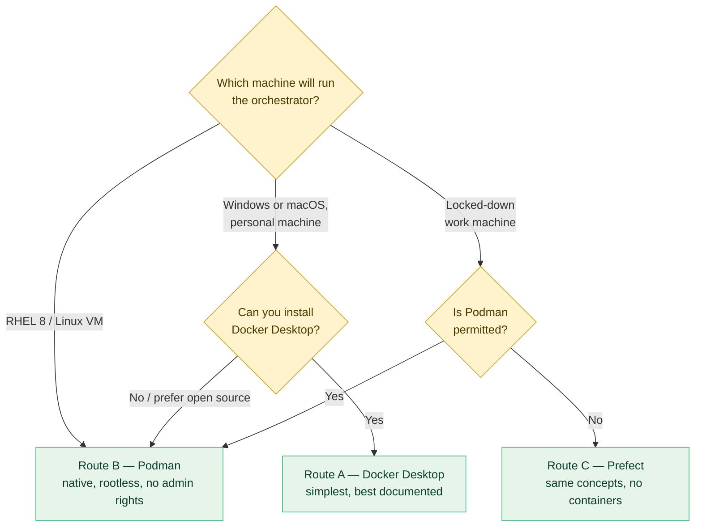

# Containers: Docker, Podman, or neither

**Prerequisites:** [`01-setup.md`](01-setup.md). Nothing here is needed until
**Phase 9b** (packaging the app, optional) or **Phase 12** (Airflow) — but read it
before then, because the choice you make affects how those phases feel.

**This document is about *choosing and installing a runtime*.** For *building
MicrobeGraph's own images* — Containerfiles, layers, volumes, networks, compose —
see [`CONTAINERIZATION.md`](CONTAINERIZATION.md). Choose your engine here; build
with it there.

**Learning goal:** understand what a container actually is, which of the three
routes suits your machine, and how to set up whichever you choose. You will also
learn why "it works on my machine" is a real engineering problem with a real
solution.

**Time:** 15 minutes reading; 20–40 minutes setup when you reach Phase 12.

> Every term here is also in [`GLOSSARY.md`](GLOSSARY.md).

---

## Contents

1. [What a container is](#1-what-a-container-is-and-the-problem-it-solves)
2. [Why this project needs one (and only at Phase 12)](#2-why-this-project-needs-one-and-only-at-phase-12)
3. [The three routes, compared](#3-the-three-routes-compared)
4. [Route A — Docker Desktop](#4-route-a--docker-desktop)
5. [Route B — Podman](#5-route-b--podman-rootless-daemonless-rhel-native)
6. [Route C — Prefect, no containers at all](#6-route-c--prefect-no-containers-at-all)
7. [Which should you pick?](#7-which-should-you-pick)
8. [Troubleshooting](#8-troubleshooting)

---

## 1. What a container is, and the problem it solves

### The problem, in everyday terms

You've built something that works perfectly on your laptop. You send it to a
colleague and it fails immediately. Different operating system, different Python
version, a library at a different version, a missing system tool. Hours disappear
into "it works on my machine."

*Everyday parallel:* you write a recipe that works in your kitchen. A friend tries
it and it fails — their oven runs hot, their flour is different, they don't own a
stand mixer. The recipe was never the whole story; the kitchen was part of it.

### The idea

A **container** ships the kitchen along with the recipe.

It's a sealed, lightweight box holding your program *plus* everything it needs to
run: the right Python, the right libraries, the right system tools, the right
configuration. That box runs identically on your Windows laptop, your colleague's
Mac, and a RHEL 8 server — because the box *is* the environment.

**Container vs virtual machine.** A virtual machine ships an entire operating
system: heavy, slow to start, gigabytes. A container shares the host's operating
system kernel and ships only what sits above it: light, starts in seconds,
megabytes. *Everyday parallel:* a VM is a whole separate house; a container is a
locked room in a shared building.

**Two words you'll see constantly:**

- **Image** — the recipe and ingredients, packaged. A blueprint. Static.
- **Container** — a running instance of an image. You can start several from one
  image, like baking several cakes from one recipe.

### How this relates to `.venv`

You already met a smaller version of this idea. A virtual environment seals your
*Python packages*. A container seals *everything* — the OS libraries, the system
tools, the Python itself. Same instinct, wider scope.

For this project's Python code, `.venv` is enough. Airflow is different: it's not
one program but several cooperating services (a scheduler, a web server, a
database), which is precisely the situation containers exist for.

---

## 2. Where containers appear in this project

Containers show up three times, each for a different reason, and never as a
requirement:

| Phase | What it is | Which way round |
|---|---|---|
| **9b** *(optional)* | Package the Streamlit app as one image | You **build** an image — the gentle version, one service |
| **12** | Run Airflow locally via the Astro CLI | You **consume** images someone else built |
| **18** | The whole stack via `compose.yaml` | You **build and orchestrate** four services together |

**Release 1.0 never requires containers.** The plain `.venv` path is supported
forever, so a fresh clone works for someone who has no interest in installing a
container engine. Everything containerized is an *additional* way to run the
project.

Phases 1–9 need no containers at all, and that's deliberate — introducing
containers before there's a multi-service system to manage would be teaching a
solution before its problem.

By **Phase 12**, the pipeline has grown into something that genuinely wants an
orchestrator: five independent sources, a strict dependency order, a monthly
schedule, retries for transient failures, and alerts when something breaks. That's
Airflow's job description.

And Airflow itself is several services that must find each other and start in the
right order. Installing them by hand is possible and unpleasant. Containers turn
it into one command.

**So:** containers arrive when the project earns them, not before. If you'd rather
not use them at all, **Route C** teaches the same orchestration concepts without
them.

---

## 3. The three routes, compared

| | **A · Docker Desktop** | **B · Podman** | **C · Prefect** |
|---|---|---|---|
| **What you run** | Airflow via Astro CLI | Airflow via Astro CLI | Prefect, plain Python |
| **Containers needed** | Yes | Yes | **No** |
| **Admin rights** | Required to install | **Not required** (rootless) | Not required |
| **Background daemon** | Yes, always running | **No daemon** | No |
| **Windows** | ✅ Best supported | ✅ Works (needs WSL2) | ✅ |
| **macOS** | ✅ Best supported | ✅ Well supported | ✅ |
| **RHEL 8 / Rocky** | ⚠️ Possible, not native | ✅ **Native — ships with RHEL** | ✅ |
| **Licence cost** | Free for personal use; **paid for larger companies** | **Fully open source, always free** | Open source |
| **Corporate-friendly** | Often blocked or licensed | Usually permitted | Always |
| **RAM needed** | ~4 GB | ~4 GB | ~1 GB |
| **What you learn** | Containers + Airflow | Containers + Airflow + rootless security | Orchestration concepts only |

**All three teach the concepts that transfer.** DAGs, dependencies, scheduling,
retries, idempotency are the same ideas in every one. Routes A and B additionally
teach containers.

### A note on Docker's licence

Docker Desktop is free for personal use, education, and small businesses, but
requires a paid subscription in larger commercial organisations. This is a common
reason it's unavailable on work machines — and a large part of why Podman exists
and why Red Hat ships it by default. Worth knowing, because "why can't I install
Docker at work?" has an answer that isn't technical.

---

## 4. Route A — Docker Desktop

Best on Windows and macOS personal machines. Most tutorials assume it, so search
results will match what you see.

### Install

<details open>
<summary><b>🪟 Windows</b></summary>

1. Enable WSL2 (Windows Subsystem for Linux) — open PowerShell **as
   Administrator**:
   ```powershell
   wsl --install
   ```
   Restart when prompted.

   *What WSL2 is:* a real Linux kernel running inside Windows. Containers are a
   Linux technology, so Windows runs them inside this.
2. Download Docker Desktop: <https://www.docker.com/products/docker-desktop/>
3. Install with defaults; ensure "Use WSL 2 based engine" is ticked.
4. Launch Docker Desktop and wait for the whale icon to stop animating.

</details>

<details open>
<summary><b>🍎 macOS</b></summary>

1. Download from <https://www.docker.com/products/docker-desktop/> — pick **Apple
   Silicon** for M-series Macs, **Intel** for older ones.
2. Drag to Applications, launch, grant the permissions it asks for.

</details>

<details open>
<summary><b>🐧 RHEL 8</b></summary>

Docker Desktop is not the natural fit here — RHEL ships Podman instead. Use
**Route B**. If you specifically need Docker Engine, it installs from Docker's own
repository, but you'll be working against the grain of the distribution.

</details>

### Verify

```bash
docker --version
docker run hello-world
```

Expected:

```
Docker version 27.3.1, build ce12230
...
Hello from Docker!
This message shows that your installation appears to be working correctly.
```

✅ **Checkpoint.** The "Hello from Docker!" message appears.

---

## 5. Route B — Podman (rootless, daemonless, RHEL-native)

**The strongest choice on RHEL 8, and often the only permitted choice on locked-
down work machines.** Three reasons:

1. **No daemon.** Docker runs a permanent background service with root privileges.
   Podman runs containers as ordinary child processes of your shell. Fewer moving
   parts, smaller attack surface.
2. **Rootless by default.** Containers run as *you*, not as root. If something in
   a container misbehaves, it has your permissions — not the machine's. On a
   shared VM this matters a great deal.
3. **No admin rights needed** to run it, and it's already installed on RHEL 8.

**Compatibility:** Podman deliberately mirrors Docker's command-line interface.
Nearly every `docker` command works as `podman`, and a `Dockerfile` and a
`Containerfile` are the same format. Most Docker tutorials translate by
substituting one word.

**Astro CLI support (verified current):** the Astro CLI auto-detects the container
runtime, checking for `docker` then `podman`. Recent Homebrew and Winget installs
of the Astro CLI even ship with Podman preconfigured. You can force the choice
explicitly if auto-detection picks wrong.

### Install

<details open>
<summary><b>🐧 RHEL 8 / Rocky / AlmaLinux</b></summary>

Often already present. Check first:

```bash
podman --version
```

If not:

```bash
sudo dnf install -y podman
```

For rootless containers you may need user namespace ranges configured. Check:

```bash
cat /etc/subuid | grep $USER
```

If nothing prints, ask your administrator to run:

```bash
sudo usermod --add-subuids 100000-165535 --add-subgids 100000-165535 $USER
```

*What that does:* gives your account a private block of user IDs that containers
map into, so a process running as "root" inside a container is a harmless
unprivileged ID outside it. This is the mechanism that makes rootless containers
safe.

</details>

<details open>
<summary><b>🍎 macOS</b></summary>

```bash
brew install podman
podman machine init
podman machine start
```

*Why the extra step:* containers need a Linux kernel. On macOS, `podman machine`
runs a small Linux VM for them. Docker Desktop does the same thing invisibly.

</details>

<details open>
<summary><b>🪟 Windows</b></summary>

1. Enable WSL2: `wsl --install` in an Administrator PowerShell, then restart.
2. Install Podman Desktop: <https://podman-desktop.io/> (or
   `winget install RedHat.Podman`).
3. Initialise the machine:
   ```powershell
   podman machine init
   podman machine start
   ```

</details>

### Verify

```bash
podman --version
podman run hello-world
```

```
podman version 4.9.4
...
Hello from Docker!
```

*(Yes, the image says "Docker" — it's the standard test image, and Podman running
it is precisely the point: the ecosystem is shared.)*

### Point the Astro CLI at Podman

Auto-detection usually handles this. To be explicit:

```bash
astro config set -g container.binary podman
```

On some setups the CLI also wants to know where Podman's socket lives:

```bash
# macOS / Windows — find the socket path
podman machine inspect --format '{{.ConnectionInfo.PodmanSocket.Path}}'

# then export it (add to your shell profile to make it permanent)
export DOCKER_HOST='unix:///path/from/the/command/above'
```

✅ **Checkpoint.** `podman run hello-world` succeeds and `astro config get -g
container.binary` returns `podman`.

### The one wrinkle worth knowing

Some Astro CLI subcommands historically assumed a `docker` binary even when
configured for Podman. If you hit one, the usual workaround is the compatibility
shim:

```bash
sudo dnf install -y podman-docker    # RHEL: provides a 'docker' command that calls podman
```

This is exactly the kind of small friction that comes with the less-travelled
path. It's manageable, and worth it for the security and licence benefits — but
it's honest to say it exists rather than let you discover it at 11pm.

---

## 6. Route C — Prefect, no containers at all

If containers are blocked, unavailable, or simply more than you want to take on
right now, **Phase 12 can be done in Prefect instead**, and you lose less than you
might think.

**What Prefect is:** a Python orchestration library. You write ordinary Python
functions, decorate them, and Prefect handles scheduling, dependency order,
retries, logging, and a monitoring dashboard.

**What you get:** DAGs, dependencies, scheduling, retries, idempotency, failure
handling, observability — the concepts that actually transfer between
orchestrators.

**What you don't get:** container experience, and Airflow's specific vocabulary
(operators, sensors, hooks, XComs).

**Install:**

```bash
pip install prefect
prefect server start        # dashboard at http://localhost:4200
```

That's it. No containers, no daemon, ~1 GB of RAM.

**The honest comparison:** Airflow is the more widely deployed orchestrator and
carries more name recognition. Prefect is markedly friendlier to learn and its
concepts map onto Airflow closely enough that moving between them is a matter of
vocabulary, not relearning.

**A pragmatic middle path:** do Phase 12 in Prefect now, and revisit Airflow later
when a container runtime becomes available. The DAG logic transfers almost
directly. Understanding orchestration is what matters; the specific tool is
replaceable.

---

## 7. Which should you pick?



**Short version:**

- **RHEL 8 VM?** → Podman. It's already there, it's rootless, it needs no admin
  rights, and it's what Red Hat expects you to use.
- **Personal Windows or Mac, want the smoothest path?** → Docker Desktop.
- **Work machine with restrictions?** → Try Podman; fall back to Prefect.
- **Not sure, want to start now?** → Prefect. Learn the concepts, add containers
  later. Nothing is wasted.

**You can change your mind.** The Phase 12 guide will document all three, and the
DAG logic is nearly identical across them.

---

## 8. Troubleshooting

### "Cannot connect to the Docker daemon"

Docker Desktop isn't running. Start it and wait for the whale icon to settle. On
Linux with Docker Engine: `sudo systemctl start docker`.

### Podman: "short-name resolution enforced but cannot prompt without a TTY"

Podman requires fully-qualified image names in non-interactive contexts. Use
`docker.io/library/hello-world` rather than `hello-world`, or add `docker.io` to
`unqualified-search-registries` in `/etc/containers/registries.conf`.

### Podman on macOS/Windows: "machine not running"

```bash
podman machine start
```

The Linux VM stops when your computer sleeps or restarts. Starting it is part of
the routine, like activating `.venv`.

### Astro CLI can't find the container engine

```bash
astro config get -g container.binary      # what does it think it should use?
which docker || which podman              # what is actually installed?
astro config set -g container.binary podman   # tell it explicitly
```

### Astro CLI errors mentioning `docker` while you're using Podman

The compatibility shim usually resolves it:

```bash
sudo dnf install -y podman-docker      # RHEL
brew install docker                     # macOS: the CLI only, no Desktop
```

### "no space left on device"

Container images accumulate. Clean up:

```bash
docker system prune -a      # or: podman system prune -a
```

⚠️ Removes all unused images and stopped containers. Safe here — everything is
rebuildable from the project files — but read the confirmation prompt before
agreeing.

### RHEL 8: rootless containers fail with a permissions error

Usually missing user-namespace ranges. Check `cat /etc/subuid | grep $USER`. If
empty, see the `usermod` command in [Route B](#5-route-b--podman-rootless-daemonless-rhel-native)
— it needs an administrator once, then never again.

### Not enough memory

Airflow wants ~4 GB. Docker Desktop → Settings → Resources → raise the memory
limit. Podman: `podman machine set --memory 4096` (stop the machine first). On a
small VM, **Route C (Prefect)** is the right answer — roughly 1 GB.

---

## Checkpoint

Before Phase 12 you should be able to say:

- [ ] What a container is, and how it differs from a virtual machine
- [ ] The difference between an image and a container
- [ ] Why containers arrive at Phase 12 and not earlier
- [ ] Which of the three routes suits your machine, and why
- [ ] Your chosen runtime is installed and its verification command passes *(or
      you've chosen Route C and installed Prefect)*

**What you learned:** the "works on my machine" problem and its solution; images
versus containers; why Podman's rootless, daemonless design matters on shared and
restricted machines; that Docker's licence — not its technology — is often why
it's unavailable at work; and that orchestration concepts transfer between tools,
so the tool is a less important choice than it first appears.

---

## Committing this phase

```bash
git switch develop
git add -A                    # stage first, so the gate can see the new files

./check-public-safe.sh        # must print "SAFE TO PUSH"

git commit -m "docs: choose and document the container runtime"
git push origin develop develop:beta develop:master

## --tags is optional, and only when cutting a new version
## then switch back to local master and pull in the changes from the remote

git switch master
git pull --ff-only origin master
git switch develop
```

---

**Next:** [`CONTAINERIZATION.md`](CONTAINERIZATION.md) — building MicrobeGraph's
own images with whichever engine you chose ·
**Plan:** [`ROADMAP.md`](ROADMAP.md) · **Setup:** [`01-setup.md`](01-setup.md)
