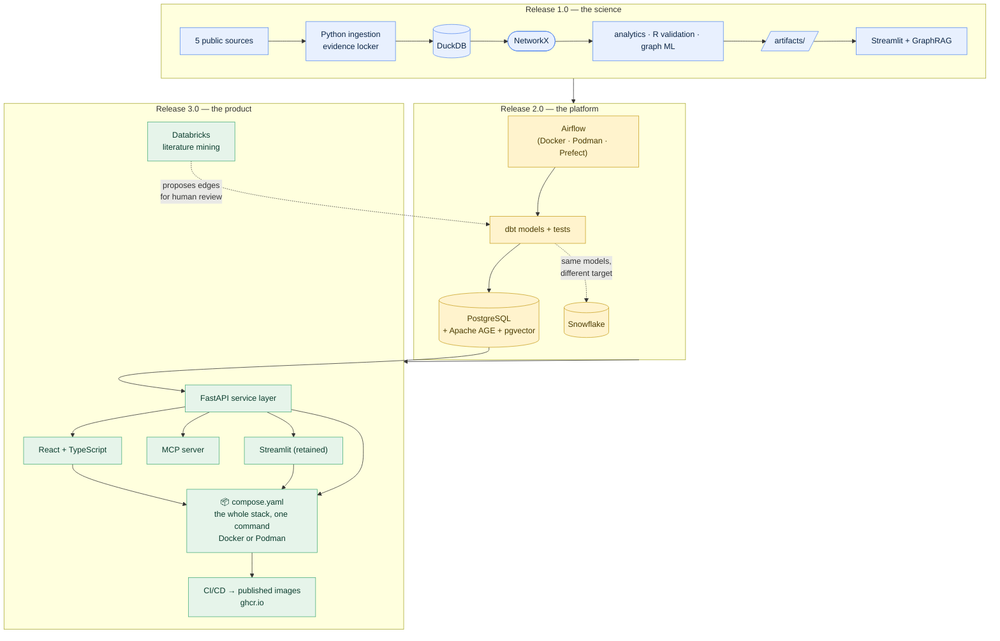

# Roadmap — the full build, in three releases

**Prerequisites:** [`00-architecture.md`](00-architecture.md). No commands here —
this is the plan, not a phase guide.

**Learning goal:** understand what gets built, in what order, and — more
importantly — **why each tool earns its place**. Every technology below is
introduced because the project genuinely needs it at that point, not because
it's fashionable. Where a tool is a weaker fit, this document says so.

**Why publish a roadmap at all?** Because a project that ends at "it works on my
laptop" and a project that has a credible path to production are different
things, and the difference is visible in the plan. Deferrals with reasons
attached are more informative than promises.

---

## Contents

- [The shape of the plan](#the-shape-of-the-plan)
- [The rule every tool must pass](#the-rule-every-tool-must-pass)
- [Release 1.0 — the science](#release-10--the-science-phases-19)
- [Release 2.0 — the platform](#release-20--the-platform-phases-1013)
- [Release 3.0 — the product](#release-30--the-product-phases-1418)
- [The architecture, in three stages](#the-architecture-in-three-stages)
- [Effort and scheduling](#effort-and-scheduling)
- [Deliberately not in the plan](#deliberately-not-in-the-plan)

---

## The shape of the plan

Nineteen phases (plus two optional sub-phases, 8b and 9b), three releases. **Each release is a complete, usable, publishable
thing on its own** — that's the design constraint. If the project stopped at 1.0
it would still be finished, not abandoned.

| Release | What it is | Phases | The question it answers |
|---|---|---|---|
| **1.0 — the science** | A working knowledge graph, statistically validated, with machine learning and a public app | 1–9 (+8b, 9b) | *Does the idea work, and can I prove it honestly?* |
| **2.0 — the platform** | The same thing, rebuilt on production data infrastructure | 10–13 | *Would this survive contact with a real data team?* |
| **3.0 — the product** | A real API, a real frontend, AI integrations, and the whole stack containerized | 14–19 | *Can other people and other systems actually use it?* |

**Read the order as deliberate.** A common mistake is to start with the platform
— orchestration, warehouses, containers — before there's anything worth
orchestrating. Building the science first means every infrastructure decision in
2.0 is made against a real workload with real requirements, which is both easier
and more honest.

---

## The rule every tool must pass

Before a technology enters this plan it has to answer one question: **what does
this project genuinely need that this tool provides?**

Not "what would look impressive." The difference matters, because anyone reading
the repository can tell when a tool is load-bearing and when it's decoration. A
Spark cluster processing four thousand rows is decoration. An orchestrator
managing five interdependent data sources on a monthly refresh is load-bearing.

Each phase below states its reason explicitly. Where a tool's fit is weaker than
the others, that's said plainly rather than hidden.

---

# Release 1.0 — the science (Phases 1–9, plus optional 8b and 9b)

*The complete data-science project: real public data, an ontology-governed graph,
statistical validation, machine learning, and a deployed app.*

---

## Phase 1 — Ingestion: the MIBiG backbone

**What gets built:** the source-adapter framework (`probe → fetch → tidy`), the
evidence locker (`data/raw/`), the provenance log, and the first real records —
organism → gene cluster → compound — from MIBiG 4.0.

**Why this first:** everything downstream needs data, and the *shape* of how data
arrives determines how painful the next five phases are. Getting the contract
right once means sources 2 through 6 are nearly free.

**Why MIBiG:** it is the only public source that reliably supplies the two arrows
at the start of every chain, each signed off by a human curator against a
published experiment. CC-BY licensed, permanent Zenodo DOI, so the exact version
used is citable.

**New concepts:** APIs, JSON, HTTP status codes, rate limits and politeness,
retry-with-backoff, the never-edit-the-original rule, provenance.

**New tools:** `requests`, `tenacity`.

**Checkpoint:** `data/raw/` holds untouched MIBiG records; `provenance.csv` has
one row per fetch; `pytest` passes on the parser using offline fixtures.

**Effort:** ~6–8 hours.

---

## Phase 2 — More sources: PubChem · NCBI Taxonomy · KEGG

**What gets built:** three more adapters plugged into the same socket, plus
proper secrets handling (`.env`, never the repository).

**Why:** this phase is where the framework proves itself. Three new sources, and
nothing downstream changes — that's not luck, it's what the contract bought in
Phase 1.

**Why these three:** PubChem gives every compound a stable identity and a synonym
list (the raw material Phase 4 needs); NCBI Taxonomy gives the lineage ladder that
makes "all *Bacillus*" a single query; KEGG adds pathway context, so chemically
unrelated compounds that share a biological process become connected.

**New concepts:** API keys and why they're secrets, the environment as a place to
store configuration, licence terms as a real constraint (KEGG is academic-use with
attribution and must not be bulk-scraped).

**Effort:** ~6–8 hours.

---

## Phase 3 — The proteomics layer: UniProt

**What gets built:** a fifth adapter fetching the **enzymes** encoded by each gene
cluster, adding `Protein` nodes and the `ENCODES` / `CATALYZES` edges.

**Why this matters more than it looks:** it turns the graph from two molecular
layers into three. The chain becomes:

```
Organism → GeneCluster → Protein → Compound → Pathogen → Crop
   (genomics)    (proteomics)   (metabolomics)   (phenotype)
```

That is genuine **multi-omics integration** — not three tables side by side, but
three measurement layers joined into one connected structure where a question can
cross all of them in a single walk. Very few portfolio projects do this; most stop
at one layer.

**The honest note:** MIBiG already gives a direct `GeneCluster → PRODUCES →
Compound` edge. We keep it *and* add the detailed protein path, because they
answer different questions (the shortcut is for fast traversal; the protein path
is for mechanism). The data model documents that both exist and why.

**Why UniProt:** free, public, comprehensive, and the standard reference for
protein sequence and function. It cross-references MIBiG accessions directly, so
the join is real rather than fuzzy.

**New concepts:** proteins as the working machinery between DNA and chemistry;
enzyme function; cross-referencing between databases.

**Effort:** ~5–7 hours.

---

## Phase 4 — Entity resolution and the graph build

**What gets built:** the resolution engine and its **ledger**, the validation
loader, and the first real graph in DuckDB + NetworkX.

**Why this is the hardest phase:** deciding that `surfactin`, `surfactin A`, and
`CID 443324` are one thing — and refusing to guess when you can't confirm it — is
the step that separates a graph you can trust from a graph that looks fine and
lies quietly. Most tutorials skip it entirely.

**What "the ledger" means:** every merge decision is written down with its
grounds. It's the answer to "how do you know these are the same thing?", and being
able to answer that is the whole basis for trusting anything the graph says.

**New concepts:** entity resolution, normalisation before comparison, why a wrong
merge is worse than a missed one, validation that *refuses* rather than warns,
SQL basics, `SELECT` / `WHERE` / `GROUP BY` / `JOIN`.

**New tools:** `duckdb`, `networkx`.

**Checkpoint:** `nodes.csv` and `edges.csv` pass all validation rules; the same
row counts appear in DuckDB and in the NetworkX graph; the ledger explains every
merge.

**Effort:** ~10–12 hours. The biggest phase in 1.0, and worth the time.

---

## Phase 5 — Graph analytics

**What gets built:** evidence-path finding, degree and betweenness centrality,
community detection, and the first interactive network visualisations.

**Why:** this is where the graph starts *answering* rather than merely existing.
The strawberry question — walk backwards from a crop to candidate microbes — works
for the first time here, and every path arrives with its own evidence chain
attached.

**The interesting output:** betweenness centrality tends to find *bridges* —
compounds that are the only known link between a group of microbes and a group of
diseases. Bridges are exactly where knowledge is thinnest and where one missing
fact does the most damage. That's a genuinely useful finding, not a pretty chart.

**New concepts:** shortest paths, centrality (and why "important" has several
meanings), community detection, why a path is only as strong as its weakest
evidence link.

**New tools:** `plotly`, `pyvis`.

**Effort:** ~8–10 hours.

---

## Phase 6 — Statistical validation in R

**What gets built:** an R script using `igraph` that (a) reproduces the key
centrality results as an independent cross-check and (b) runs **permutation
tests** asking whether the observed structure is more than chance.

**Why this phase exists — and it's the one most projects skip:** a graph built
from real data still produces communities and hubs *even if the underlying
relationships are random*, because any network has structure. Without a null
model, "we found three communities" means nothing. A permutation test rewires the
graph thousands of times keeping the degree distribution fixed, and asks: is the
real clustering stronger than the shuffled versions?

That question — *could this have happened by chance?* — is the difference between
data analysis and statistics, and answering it is what makes the rest of the
project defensible.

**Why R specifically:** R is the language built by statisticians, and `igraph`'s R
interface is mature and well-documented for exactly this. It also gives the
project an honest **"same task, two languages"** comparison: the same centrality
computed in Python/NetworkX and R/igraph, with commentary on what each is best at.
Agreement between two independent implementations is itself a validation.

**New concepts:** null models, permutation testing, p-values in a network context,
degree-preserving rewiring, cross-implementation validation.

**New tools:** R, RStudio, `igraph`, `DBI` + `duckdb` (reading the project
database from R), `dplyr`, `ggplot2` (the publication-quality figures in
`docs/img/`), and `renv` — R's sealed toolbox, the exact counterpart of `.venv`,
with `renv.lock` playing the role of `requirements.lock.txt`.

**Effort:** ~6–8 hours.

---

## Phase 7 — Graph machine learning

**What gets built:** node embeddings (node2vec), a supervised link-prediction
model with proper negative sampling, cross-validated evaluation, feature
importance, and an honest error analysis.

**Why this is the technical heart of Release 1.0:** everything before it describes
what's known. This phase *predicts* — it scores arrows that don't exist yet and
asks which ones probably should.

**What a node embedding is, briefly:** a way of turning each node's position in
the graph into a list of numbers, such that nodes with similar connection patterns
end up with similar numbers. Once every node is a vector, ordinary machine learning
applies. *Everyday parallel:* describing a person by which social circles they move
in, then finding people with similar descriptions.

**The three things that make this rigorous rather than decorative:**

1. **Negative sampling done properly.** Link prediction has a trap: there are vastly
   more absent arrows than present ones, so a model that always says "no link"
   scores brilliantly and is useless. The training set has to be constructed
   deliberately, and the class imbalance handled explicitly.
2. **The right split.** You cannot randomly split edges when the features are
   *derived from the graph those edges are in* — the model would see the answer.
   Edges must be held out **before** embeddings are computed. This is a real,
   subtle leakage trap, and documenting it is worth as much as the model.
3. **Honest evaluation.** Precision-recall rather than accuracy (because of the
   imbalance), cross-validation, and a written error analysis of what the model
   gets wrong and why.

**The honesty rule:** every predicted edge is stored `evidence_level = inferred`,
kept in its own layer, drawn differently in the app, and excluded from evidence
chains by default. A prediction is a reason to look, never a finding.

**New concepts:** embeddings, negative sampling, data leakage in graphs,
train/test splitting for relational data, precision-recall, class imbalance,
cross-validation, error analysis.

**New tools:** `scikit-learn`, `node2vec` (or `gensim`).

**Effort:** ~12–14 hours. The most demanding phase, and the most valuable.

---

## Phase 8 — The Streamlit app

**What gets built:** four areas — Explore (filter the graph by type, source, and
evidence level), Trace (evidence chains with every arrow's provenance), Rank
(candidate microbes for a chosen pathogen), and Query (a read-only SQL console).

**Why Streamlit first, not React:** the fastest honest path from analysis to
something a person can click. React comes in Phase 15, and by then there'll be a
real API to build against — which is the right order.

**Why "read-only by construction" matters:** the SQL console is enforced read-only
in code with two independent locks (a validated query parser *and* a read-only
connection), not promised in documentation. Anything a user can type into is a
thing you must design against misuse.

**New concepts:** frontend vs backend in practice, reactivity, state, why the app
reads precomputed artifacts rather than recomputing.

**Effort:** ~10–12 hours.

---

## Phase 8b — The same app in R Shiny (optional)

**What gets built:** the core of the Streamlit app rebuilt in **R Shiny** — pick a
pathogen, see candidate microbes, trace the evidence chain — reading the *same*
DuckDB file, producing the *same* answers, in a different language.

### What Shiny is, in plain words

**Shiny** is R's equivalent of Streamlit: a library that turns R code into a web
application with dropdowns, sliders, tables and plots, without writing any web
code yourself.

*Everyday parallel:* Streamlit and Shiny are two brands of flat-pack furniture.
Both give you a wardrobe from a box and an Allen key. They assemble differently
and the finished pieces have different strengths — but you did not have to be a
carpenter for either.

### Why build the same thing twice? That sounds like waste

It is the opposite of waste, for three specific reasons.

**1. It is the clearest comparison you can make.** Comparing languages by reading
about them teaches you very little. Comparing them by building *the identical
thing* in both, with the same data and the same requirements, teaches you exactly
where each one is comfortable and where it fights you. Everything except the
language is held constant — which is, incidentally, how a controlled experiment
works.

*Everyday parallel:* you learn far more about two knives by chopping the same
onion with each than by reading two knife reviews.

**2. It proves the architecture was right.** Remember the design decision from
[`00-architecture.md`](00-architecture.md): the *app* is a thin frontend, and all
the real work lives in the backend and the database. If that separation is
genuine, a second frontend in a completely different language should be
straightforward — it just reads the same tables and draws them.

**If it turns out to be hard, that is a finding.** It would mean logic had leaked
into the Streamlit app that should have been in the shared layer. Building the
second app is therefore a *test of the first one's design*, and it is the kind of
test you cannot fake.

**3. It settles a real argument.** "Streamlit or Shiny?" is a question teams
genuinely disagree about, usually without either side having built the same thing
in both. Having done it, you can answer from evidence rather than preference.

### The two models of how an app updates

This is the heart of the comparison, and it is worth understanding properly
because it explains almost every difference you will notice.

**Streamlit re-runs the whole script.** Every time you touch a control, Streamlit
executes your script from the first line to the last, with the new value in
place. Simple to reason about — there is only one path through the code — and
occasionally wasteful, because it redoes work that did not need redoing.

*Everyday parallel:* a chef who, whenever an order changes, throws out the dish
and cooks it again from raw ingredients. Never confusing, sometimes slow.

**Shiny recalculates only what changed.** Shiny builds a dependency map of your
outputs: this chart depends on that dropdown, that table depends on this slider.
Change one input and only the outputs downstream of it recompute. This is called
**reactive programming**.

*Everyday parallel:* a spreadsheet. Change cell B2 and only the formulas that
reference B2 update — the rest of the sheet sits still. You have used reactive
programming for years without calling it that.

**The trade-off, stated fairly:** Shiny's model is more efficient and scales
better to complex applications. It is also harder to learn, because the code no
longer runs top to bottom and you must think in terms of dependencies rather than
sequence. Streamlit's model is easier to hold in your head and does more work
than strictly necessary.

**Neither is correct.** They are different answers to the same question, and
knowing *why* each was chosen is worth more than knowing either syntax.

### The other structural difference: `ui` and `server`

Every Shiny app has exactly two halves, and this catches Streamlit users out:

- **`ui`** — *what the page looks like.* Which controls exist, where they sit.
- **`server`** — *what the app does.* How inputs become outputs.

Streamlit mixes these freely: you write a slider and then immediately use its
value, on the next line.

*Everyday parallel:* Shiny is a restaurant with a printed menu (the `ui`) and a
kitchen (the `server`) — designed separately, connected by order numbers.
Streamlit is a food truck where you point at what you want and watch it being
made. Both feed you. One separates concerns; one keeps everything in view.

**Which is better?** For a small app, Streamlit's directness wins. As an app
grows, Shiny's separation stops it becoming a tangle. That is a genuine
engineering pattern — separating presentation from logic — and meeting it here,
in a small app you already understand, is the easiest place to learn it.

### What gets built, concretely

| Piece | Streamlit (Phase 8) | Shiny (Phase 8b) |
|---|---|---|
| Read the database | `duckdb.connect()` | `DBI::dbConnect(duckdb::duckdb())` |
| Dropdown | `st.selectbox()` | `selectInput()` in `ui` |
| Table | `st.dataframe()` | `renderDT()` in `server` |
| Chart | `plotly` | `ggplot2` + `renderPlot()` |
| Network view | `pyvis` | `visNetwork` |
| Run it | `streamlit run app.py` | `shiny::runApp("shiny/")` |

The file is `shiny/app.R` — Shiny's convention is one file with `ui` and `server`
in it, which keeps a small app in one place.

### Deploying it

**shinyapps.io** has a free tier from the same company that makes RStudio: a
handful of applications and a monthly quota of active hours, which is ample for a
portfolio project. Publishing is one command from RStudio. The free tier's limits
and signup steps are checked and written out when this phase is built, since these
change.

### Honest costs

- **~8–10 hours**, most of it learning reactivity rather than writing code.
- **A second app to keep in step** when the shared layer changes. Real, and
  manageable because both are thin.
- **A second deployment** to maintain, if you publish both.

### What you will be able to say afterwards

Not "I know R and Python" — plenty of people say that. Instead: *"I built the same
application in Streamlit and in Shiny, over one shared database, and here is
specifically where each one was better and why."* That is a concrete, evidenced
statement about two ecosystems, and very few people have earned the right to make
it.

**Effort:** ~8–10 hours. **Prerequisites:** Phase 8 (the Streamlit app) and
[`R-SETUP.md`](R-SETUP.md).

---

## Phase 9 — Deployment, GraphRAG, and release 1.0

**What gets built:** the app deployed free and public; the GraphRAG answer layer;
release notes, licence, version tag.

**GraphRAG in one line:** answer a question by *walking the graph* to collect the
relevant facts, then hand only those facts to a language model to phrase the
answer — so every sentence is grounded in a real, cited chain rather than the
model's memory.

**Why it fits this project unusually well:** in most RAG systems you retrieve
paragraphs and hope they contain the connection. Here the connections *are* the
data, so retrieval returns an assembled evidence chain with provenance on every
link. The answer arrives with its own footnotes.

**Graceful degradation:** no API key configured → the feature hides itself and
everything else works. A project that needs a paid service to demonstrate anything
is fragile.

**New concepts:** deployment, secrets in a hosted environment, LLMs,
hallucination, RAG, GraphRAG, prompt grounding, semantic versioning.

**Effort:** ~8–10 hours.

## Phase 9b — One container (optional)

**What gets built:** a `Containerfile` and a `.dockerignore` that package the
Streamlit app into a single image, runnable with one command under **either
Docker or Podman**.

```bash
docker build -t microbegraph-app .   # or: podman build ...
docker run -p 8501:8501 microbegraph-app
```

**Why optional, and why here:** Release 1.0 must stay runnable with nothing but
`.venv` — a fresh clone should work for someone who has no interest in installing
a container engine. So this is an *additional* way to run the project, never a
replacement.

But it's placed here deliberately, because **this is the easiest possible place to
learn containers**: one service, one image, one port. No inter-service networking,
no start-order problems, no volumes for a database. Learn the ideas where there's
only one thing to get wrong, then meet the complicated version in Phase 18 already
knowing what an image and a layer are.

**The payoff, immediately:** anyone can run your app on a machine with no Python,
no pandas, no NetworkX — one command. That's a meaningful jump from "here is my
code" toward "here is my application".

**New concepts:** images vs containers, base images, layers and build caching (and
why copying `requirements.txt` before your code makes rebuilds 90× faster),
`.dockerignore`, publishing ports, running as a non-root user, health checks,
why a server must bind `0.0.0.0` rather than `localhost` inside a container.

**New tools:** Docker **or** Podman — one set of files works with both. Full
guide: [`CONTAINERIZATION.md`](CONTAINERIZATION.md).

**Checkpoint:** `docker run -p 8501:8501 microbegraph-app` serves the app at
`http://localhost:8501` on a machine where Python was never installed.

**Effort:** ~4–5 hours.

---

### 🏁 Release 1.0 is a complete project

At this point the repository contains: five real public data sources, an
ontology-governed multi-omics knowledge graph, entity resolution with a ledger,
statistical validation against a null model, machine learning with honest
evaluation, a deployed public app, an AI answer layer, optionally the
same app rebuilt in R Shiny and a runnable container image, and a full beginner
tutorial. **That is a finished
thing.** Everything below is genuine improvement,
not completion.

---

# Release 2.0 — the platform (Phases 10–13)

*Rebuilding the same system on the infrastructure a real data team would use —
each piece introduced because the project has grown a need for it.*

---

## Phase 10 — dbt: the ontology becomes tested SQL

**What gets built:** the transform from raw source tables → `nodes` / `edges`
moved out of Python and into **dbt** models, with the ontology's validation rules
expressed as dbt tests.

**Why this is the best fit in the entire plan:** look at what the loader currently
does — enforce uniqueness of `node_id`, enforce that every `source_id` exists in
`nodes`, enforce that `edge_type` is one of eight allowed values, enforce that
`evidence_level` is one of four. Those are, precisely and without adaptation, dbt's
four built-in tests: `unique`, `relationships`, `accepted_values`, `not_null`.

**Your ontology document becomes `schema.yml`.** That is not a contrived teaching
example — it's what dbt is for.

**What dbt is, plainly:** a tool that turns a folder of SQL files into a tested,
documented, version-controlled transformation pipeline. It works out which model
depends on which, runs them in the right order, tests the results, and generates
browsable documentation with a dependency graph.

**What you gain concretely:** transformations become SQL that anyone can read
(rather than Python only you can read), data quality becomes automated tests that
run on every build, and the whole pipeline gets auto-generated documentation.

**Cost:** free — dbt Core, running against your existing DuckDB.

**New concepts:** ELT vs ETL, staging / intermediate / mart layering, model
materialisation (view vs table), data tests, lineage, `dbt docs`.

**Effort:** ~8–10 hours.

---

## Phase 11 — PostgreSQL + Apache AGE + pgvector

**What gets built:** the graph migrated to PostgreSQL, with **Apache AGE** for
graph storage and Cypher queries, and **pgvector** for the RAG layer's embeddings.

**Why Postgres, and why now:** three separate needs converge on one engine —

1. **A real graph database.** NetworkX holds the graph in memory, which is fine at
   this size but isn't how production graphs run. Apache AGE is a Postgres
   extension that adds graph storage and **Cypher**, the standard graph query
   language. You get graph-database skills without running a second server.
2. **A vector store.** The GraphRAG layer needs to find semantically similar nodes.
   `pgvector` adds vector similarity search to the same database.
3. **An application database.** FastAPI and React (Release 3.0) need a proper
   server database anyway.

One engine, three jobs. That convergence is the reason — not "Postgres is
popular."

**Why not Neo4j:** it's excellent and it's the better-known graph database. But
adding it would mean a second server, a second data copy, and a second thing to
keep in sync, purely to get Cypher — which AGE already provides inside a database
we need regardless. Documented as a considered rejection, not an oversight.

**The portability lesson, kept:** DuckDB remains the zero-setup local path. The
project runs either way, and switching is a config change. **That** is the
transferable skill — environment portability is worth more than knowing one
database.

**New concepts:** client-server databases vs embedded, connection strings,
migrations, extensions, Cypher, vector embeddings and similarity search, indexes.

**Effort:** ~10–12 hours.

---

## Phase 12 — Airflow orchestration

**What gets built:** the whole pipeline as an Airflow DAG — five source fetches
running in parallel, then resolve, then build, then dbt tests, then artifact
export — on a monthly schedule with retries and failure alerts.

**Why Airflow genuinely earns its place here:** by Phase 12 the pipeline has five
independent sources, a strict dependency order (resolve cannot start until all
fetches finish; build cannot start until resolve succeeds), a need to re-run
monthly, a need to retry transient network failures without redoing successful
work, and a need to be told when something breaks. That list *is* Airflow's
purpose. Running it by hand and remembering the order is the problem Airflow
exists to solve.

**Cost:** free — Apache Airflow via the Astro CLI, locally.

**Container runtime — all three paths supported:** the Astro CLI needs a container
engine, and there are three routes depending on your machine. **Docker Desktop**
(Windows/macOS, simplest), **Podman** (rootless, daemonless, no admin rights
required, and the native choice on RHEL 8 — the Astro CLI auto-detects it and
recent installers bundle it), or **Prefect** as a container-free fallback that
teaches the same orchestration concepts in pure Python. Full comparison and setup
for each: [`CONTAINERS.md`](CONTAINERS.md).

**New concepts:** DAGs, tasks and dependencies, scheduling, idempotency,
backfills, retries and exponential backoff, sensors, containers, images vs
containers, volumes.

**Effort:** ~10–12 hours (add ~4 if containers are new to you).

---

## Phase 13 — Snowflake portability

**What gets built:** the same dbt models pointed at a **Snowflake** warehouse
instead of DuckDB, plus a documented, small procedure for switching between them.

**Why this is worth a phase:** because of how *little* has to change. dbt separates
what a transformation says from where it runs, so moving from a laptop database to
a cloud warehouse is a change of profile target, not a rewrite. Demonstrating that
— running one project against two completely different engines, with the same
tests passing on both — is a more valuable thing to show than either engine alone.

**Cost:** verified current — Snowflake offers a 30-day trial with $400 of credits
and no credit card. It **expires**, which is exactly why the project is built
local-first: when the trial ends, everything still works on DuckDB. The phase
includes explicit cost-avoidance steps (warehouse auto-suspend, the smallest
warehouse size, and how to check credit consumption).

**Honest framing:** at this data volume Snowflake is enormous overkill, and the
docs will say so. The phase is about **portability as a demonstrated skill**, not
about needing a warehouse.

**New concepts:** cloud data warehouses, separation of storage and compute,
virtual warehouses, credits and cost control, dbt profiles and targets.

**Effort:** ~6–8 hours.

---

# Release 3.0 — the product (Phases 14–19)

*Turning a working system into something other people and other software can use.*

---

## Phase 14 — FastAPI service layer

**What gets built:** a REST API exposing the graph's core operations — find paths,
rank candidates, fetch a node's neighbourhood, run a validated read-only query —
with automatic interactive documentation.

**Why this is necessary rather than nice:** by Release 3.0, three separate things
need the same query logic: the Streamlit app, the React frontend, and the MCP
server. Without a service layer you write that logic three times and it drifts
apart. With one, all three become thin clients.

That's also exactly the collaboration pattern in real teams — data scientists ship
a model behind an API and software engineers build against it, rather than
embedding the science inside the application.

**Why FastAPI:** it generates interactive documentation from your code
automatically, validates every request against declared types before your function
runs, and is fast. Its type-based validation is the same idea as the ontology's
validation rules, applied to API traffic.

**New concepts:** REST, endpoints, HTTP verbs, request/response models, automatic
validation, OpenAPI, async, API documentation, error handling and status codes.

**Effort:** ~10–12 hours.

---

## Phase 15 — React + TypeScript frontend

**What gets built:** a proper web frontend — interactive graph canvas, evidence-
chain viewer, candidate ranking table — talking to the FastAPI backend.

**Why now and not earlier:** because now there's an API to build against. Building
a frontend before the backend exists means inventing the contract twice.

**Why both this and Streamlit:** they're different products for different users.
The Streamlit app is the analyst's workbench — fast to change, dense with
controls. The React app is the public product — polished, responsive, shareable.
Keeping both is more honest than pretending one replaces the other.

**What TypeScript adds over JavaScript, plainly:** types are seatbelts. In
JavaScript, passing a number where text was expected fails silently at runtime,
possibly in front of a user. TypeScript catches it while you type. For anything
beyond a trivial script, it's worth the small extra effort.

**New concepts:** JavaScript and TypeScript, components, props and state, the
build step, npm, calling an API from a browser, CORS, responsive layout, deploying
a static frontend.

**Effort:** ~14–16 hours. The largest single phase — a genuinely new language and
ecosystem. Flagged honestly as such.

---

## Phase 16 — MCP server

**What gets built:** a Model Context Protocol server wrapping the FastAPI
endpoints, so an AI assistant can query the graph directly — find a path, rank
candidates for a pathogen, retrieve evidence.

**Why it's small but high-value:** the hard work is already done in Phase 14. MCP
is a thin, standardised wrapper over an API that exists. A few hours of work for a
capability very few projects have.

**What MCP is:** an open standard for letting AI assistants plug into external
tools and data. *Everyday parallel:* USB — one agreed shape, so any device works
with any computer.

**Security is the design:** every tool is read-only with validated, fixed inputs.
It can look up; it cannot alter, delete, or fetch. Narrow scope is deliberate.

**New concepts:** MCP, tool schemas, tool-calling, why scoping an AI's permissions
is a design decision rather than an afterthought.

**Effort:** ~5–6 hours.

---

## Phase 17 — Databricks: literature mining at scale

**What gets built:** a batch job that reads thousands of paper abstracts, uses a
language model to extract candidate *compound → inhibits → pathogen* statements,
and proposes them for human review.

**Why this is the one honest use of Spark in this project — and I'll be direct
about the alternative:** at four thousand nodes, distributed compute is theatre,
and a phase that used Databricks to run a `GROUP BY` would be obvious decoration.
But this job is different: reading and running a model over tens of thousands of
documents is real batch compute, and it's genuinely awkward on a laptop.

**Why it's also the most valuable extension:** it attacks the exact gap the curated
bridge layer papers over. Those compound → pathogen links are hand-curated because
they live in prose. This phase is the beginning of extracting them at scale — with
every proposal going to human review and entering as `curated_literature` with a
citation only after a person accepts it. **The machine proposes; a human disposes.**
That boundary is the phase's whole design.

**Cost:** verified current — Databricks **Free Edition** is perpetually free
(it replaced Community Edition, retired January 2026), serverless, and includes
notebooks, GPUs and agent tooling. A local Spark fallback is documented for anyone
who prefers not to sign up.

**Honest ranking:** this is the *weakest-justified* tool in the plan, and it's
placed last in the release for that reason. If effort has to be cut, cut here
first.

**New concepts:** distributed compute, Spark, lakehouse, notebooks at scale,
named-entity recognition, LLM-assisted extraction, human-in-the-loop review.

**Effort:** ~10–12 hours.

---

## Phase 18 — Containerize the whole application

**What gets built:** a `Containerfile` for every service and one `compose.yaml`
describing the complete system — **PostgreSQL + FastAPI + Streamlit + React** —
with health checks, named volumes, an internal network, and secrets read from
`.env` at run time. Working identically under **Docker and Podman**.

The end state:

```bash
git clone https://github.com/akannan2987/microbegraph.git
cd microbegraph
cp .env.example .env          # set a database password
docker compose up             # or: podman compose up
```

Two commands, and the entire system runs on a machine with **no Python, no R, no
PostgreSQL, no configuration**.

**Why this is a phase and not a footnote:** by Release 3.0 the project is four
cooperating services. Each needs its own setup, they must start in the right
order, and each must know where the others live. Running that by hand means four
terminal windows and a page of notes that goes stale. This phase turns it into one
command — and that difference is the line between *"here is my code"* and *"here
is my application"*.

**Why after Phase 15, not before:** you containerize something finished, not
something still moving. Doing this earlier means rebuilding every image each time
the shape changes.

**The problems this phase actually teaches you to solve** — each one is a real trap
with a real fix:

- **"Started" is not "ready".** The database container starts in a second; the
  database *program* takes fifteen. An API that connects immediately gets
  *connection refused*. Health checks plus `condition: service_healthy` are the
  fix — waiting for the kettle's *click*, not the switch.
- **`localhost` means something different inside a container.** It means *this
  container*, not your machine. Services address each other by **service name**
  (`postgres:5432`) — an internal phone directory, immune to the IP changes that
  happen on every restart.
- **Containers are disposable.** Everything written inside vanishes on removal —
  which is a feature, until it's your database. **Volumes** are the suitcase that
  leaves the hotel room with you.
- **A secret baked into an image is public forever.** Layers keep everything;
  deleting a file in a later layer does not remove it from the earlier one.
  Secrets arrive at run time, never build time.
- **Not everything should be reachable.** The database gets no published port at
  all — visible to the other services on the internal network, invisible from
  outside. A deliberate default, not an accident.

**One set of files, both engines.** Three decisions make Docker and Podman
interchangeable with no duplicated configuration: name recipe files
`Containerfile` (both engines read it), publish only ports above 1024 (rootless
Podman cannot bind lower ones), and put `:Z` on every volume mount (Docker ignores
it; Podman on RHEL 8 requires it for SELinux). **No separate Podman version of
anything.**

**New concepts:** compose files, service discovery by name, internal networks,
published vs internal ports, named volumes vs bind mounts, health checks and start
conditions, multi-stage builds (the React image goes from ~1.2 GB to ~25 MB by not
shipping the build tools), non-root containers, SELinux labelling, systemd/Quadlet
autostart on Linux servers.

**Full guide:** [`CONTAINERIZATION.md`](CONTAINERIZATION.md) — written from zero,
with the Containerfile explained line by line.

**Effort:** ~10–12 hours (~6 if you did Phase 9b, which front-loads half the
concepts).

---

## Phase 19 — CI/CD, published images, and release 2.0

**What gets built:** GitHub Actions running the test suite on every push across
Windows, macOS and Linux; automated multi-platform image builds published to the
GitHub Container Registry; image vulnerability scanning; and the final release
notes.

**Why last:** you automate the building of images that already exist and are
known-good. Automating a moving target wastes the effort twice.

**What automated builds buy you concretely:** after this phase, anyone can run the
application with no clone, no build, and no Python at all:

```bash
docker run -p 8501:8501 ghcr.io/akannan2987/microbegraph-app:latest
```

**Why CI matters even on a solo project:** a "tests passing" badge on a README is
either evidence or decoration. With CI it's evidence — every push runs the full
suite automatically, on three operating systems, so the cross-platform claim this
project makes is *verified* rather than asserted. That's the honest version of a
green badge.

**Multi-platform builds, and why they matter:** Apple Silicon Macs are ARM; most
servers are x86. `docker buildx` builds both architectures from one command, so
one tag works everywhere. Without it, a Mac-built image fails on a server with a
baffling `exec format error`.

**New concepts:** continuous integration, workflow files, build matrices, container
registries, image tagging strategies (version, commit, `latest`), multi-platform
builds, automated vulnerability scanning, release automation.

**Effort:** ~8–10 hours.

---

## The architecture, in three stages

How the picture changes with each release:



**The thing to notice:** Release 1.0's components don't get thrown away. DuckDB
stays as the local path, Streamlit stays as the analyst tool, NetworkX stays for
in-memory algorithms. Each release *adds a production tier* alongside what exists,
which is both how real systems evolve and what keeps the project runnable on a
laptop with no accounts at every stage.

---

## Effort and scheduling

Realistic at **4–5.5 hours per week**, assuming some weeks are missed:

| Release | Phases | Hours | Calendar |
|---|---|---|---|
| 1.0 — the science | 1–9 | ~75–90 | ~16–20 weeks |
| 1.0 — the same app in Shiny *(optional)* | 8b | ~8–10 | ~2 weeks |
| 1.0 — one container *(optional)* | 9b | ~4–5 | ~1 week |
| 2.0 — the platform | 10–13 | ~35–42 | ~8–10 weeks |
| 3.0 — the product | 14–19 | ~52–62 | ~12–14 weeks |
| **Total** | **19 (+8b, 9b)** | **~174–209** | **~39–47 weeks** |

**How to read that honestly.** It is a substantial commitment — roughly a
part-time year. Three things make it manageable:

1. **Every phase ends at a checkpoint** with something working and committed. You
   can stop after any phase and the repository is coherent.
2. **Every release is a finished product.** 1.0 alone is complete and publishable.
   Do not let Release 2.0 hold Release 1.0 hostage.
3. **The roadmap itself is a deliverable.** A README that lays out phases 10–18
   with reasons attached, marked as planned, communicates the thinking behind them
   before the code exists. Deferrals with reasons beat promises.

**The single most important scheduling advice:** ship 1.0 before starting 2.0.
A finished small thing is worth considerably more than an unfinished large one.

---

## Deliberately not in the plan

Considered and rejected, with reasons — because knowing why *not* to use a tool is
as informative as knowing how to use one:

- **Neo4j** — Apache AGE gives Cypher and graph storage inside a Postgres instance
  the project needs anyway. Adding a second graph server would mean a second data
  copy and a sync problem, purely for a query language we already have.
- **Kubernetes** — solves scaling and orchestration problems for *many* services
  under real load, across many machines. This project has four services on one
  machine, and `compose` (Phase 18) handles that completely. Kubernetes here would
  be pure ceremony. **Note the distinction:** containers themselves are firmly *in*
  the plan — it's the cluster orchestrator that isn't, because the problem it
  solves doesn't exist here yet.
- **Kafka / streaming** — the data sources update on a scale of *months*. A monthly
  batch is not a compromise here; it's the correct design. Streaming would be
  solving a problem that doesn't exist.
- **Deep learning for the core prediction** — the graph is small and the whole point
  is explainable, evidence-backed suggestions. Classical ML with feature importance
  is both stronger and more honest at this size. Node embeddings (Phase 7) already
  bring in the representation-learning ideas that matter.
- **A second cloud (AWS/GCP/Azure) beyond the free tiers named** — no capability
  gained, real cost risk added.

---

*This roadmap is a plan, not a promise. Phases will shift as the earlier ones teach
things the later ones need — and when they do, this document gets updated with the
reason, because a plan that never changes was never really being followed.*
